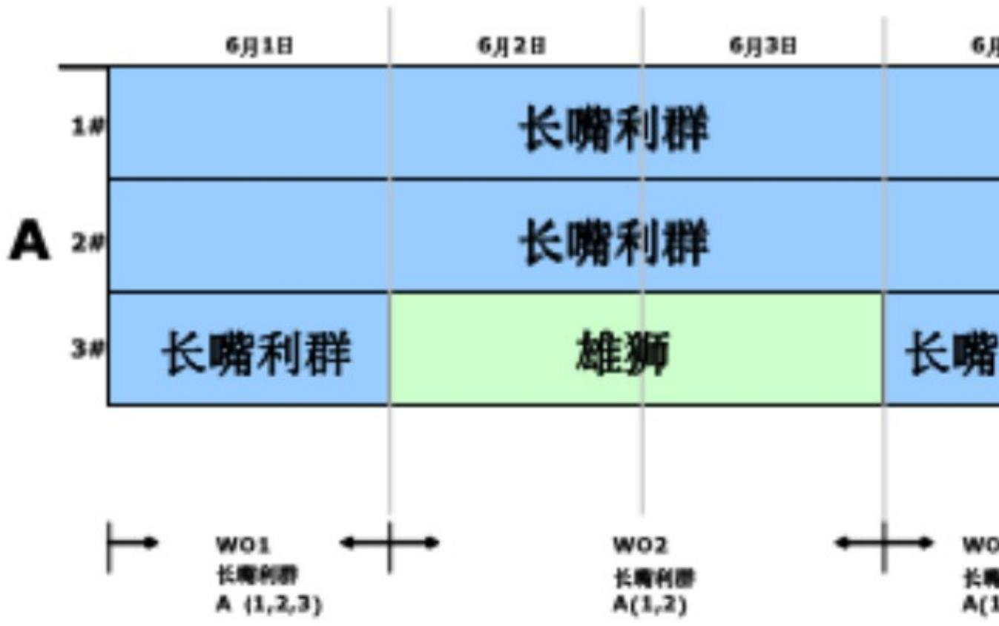
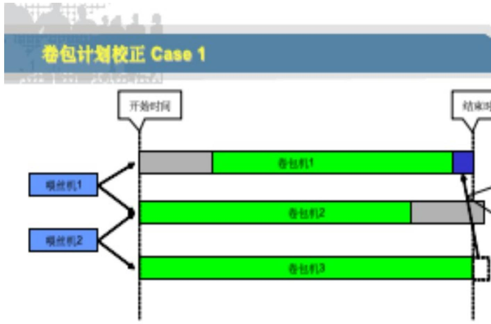
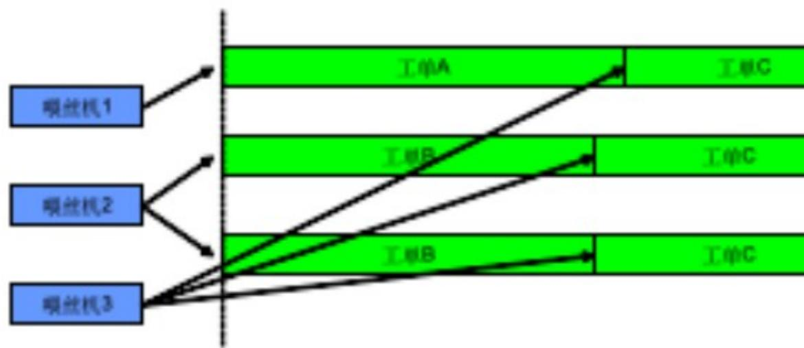
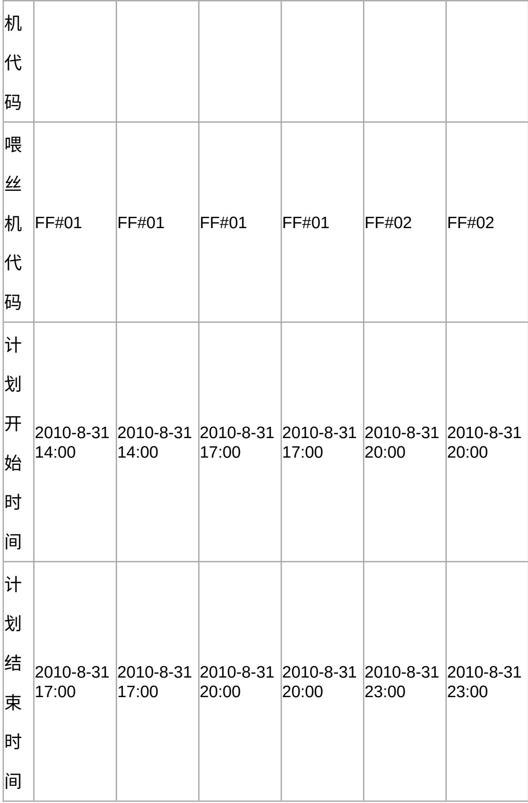
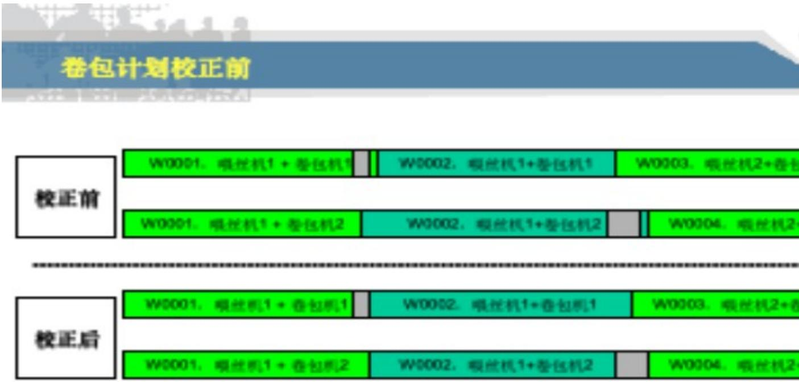

# 1.1 卷包旬计划录入，合并、拆分描述

# 1.1.1 业务与需求描述

由于卷包旬计划仅对设备轮保、机台的加工速度做粗略的考虑，因此，其结果并不能准确的反映卷包车间实际的作业计划。但卷包作业计划的准确与否直接关系到制丝作业计划的准确性，因此，在APS中，首先需要在卷包旬计划的基础上，制定详细的卷包作业计划。

APS中的卷包段作业排产在以下方面进行更加准确的计算：

·不同卷包机台加工不同成品烟时的速度差异

（aps_machine_speed表）

·卷包机台的工作日历（开机班次、停机时间、轮保时间等）。卷包机台轮保时间有MES提供。

（aps_shift_config、aps_maintenance_plan表）

·最后记录到

aps_work_order_schedule、aps_feeding_order、aps_packing_order等表

# 1.1.2 输入输出

# 1.1.2.1 输入 - 卷包排产计划

<table><tr><td>字段说明</td><td>类型</td><td>字段 ID</td></tr></table>

<table><tr><td>生产订单号</td><td>文本</td><td>WorkOrder
Nr</td></tr><tr><td>成品烟牌号</td><td>文本</td><td>ArticleNr</td></tr><tr><td>投料总量</td><td>整数</td><td>QuantityTot
al</td></tr><tr><td>成品数量</td><td>整数</td><td>FinalQuantit
y</td></tr><tr><td>卷包机代码</td><td>文本</td><td>MakerCode</td></tr><tr><td>喂丝机代码</td><td>文本</td><td>FeederCode</td></tr><tr><td>计划开始时间</td><td>时间戳</td><td>PlannedStar
t</td></tr><tr><td>计划结束时间</td><td>时间戳</td><td>PlannedEnd</td></tr></table>

# 表1卷包排产计划输入格式

（aps_import_plan、aps_decade_plan数据表）

调度手工输入卷包包计划的订单，需要给出该生产单元在加工给定定单时，包含哪些设备。

对于卷包计划要求的同时开始，同时结束，是指对于同一工单下，所有喂丝机对应的卷包机台，同时开始，同时结束。对应同一个月的卷包包计划。如果成品牌号、卷包机代码、喂丝机代码相同，着进行合并。

合并后的卷包工单，对应属性规则：

计划开始时间：前一个卷包旬计划的开始时间计划结束时间：后一个卷包询计划的结束时间

数量：两个旬计划数量之和

成品数量：两个旬计划数量之和

喂丝机代码、卷包机组代码：旬计划对应的机组

# 1.1.2.2 输入卷包剩余数量

喂丝机工单的剩余数量 = 计划数量 - 已创建批次数量卷包机剩余数量 = 喂丝机工单的剩余数量 / 对应的卷包机数量。

# 调研问题6：卷包任务完成情况，应根据烟丝消耗情况计算

卷包实际生产的数量，不等于计划的烟丝数量，可能有浮动。为了保证计划的完整性，应该以烟丝为基础推算卷包的完工数量。

喂丝机工单的剩余数量 = 计划数量 - 已创建批次数量

# 1.1.2.3 输出 - 卷包作业任务、喂丝机工单

APS 将拆分的卷包工作计划，喂丝机工单导出到 MES。每个卷包机组对应一个卷包工单。卷包计划的开始结束时间，取旬计划的开始结束时间，数量平均分配。喂丝机工单对应卷包旬计划内的所有喂丝机。对于前后月份，月份不同，牌号不同的工单，需要生成备用工单。

# 1.1.3 业务逻辑与规则

# 1.1.3.1 卷包机组合并、拆分原则

卷包计划合并的原则：

·旬计划在同一个月份内·喂丝机、卷包机组相同·成品牌号系统

合并后的卷包工单，对应属性规则：

·计划开始时间：前一个卷包旬计划的开始时间

·计划结束时间：后一个卷包询计划的结束时间

·数量：两个旬计划数量之和

·成品数量：两个旬计划数量之和

·喂丝机代码、卷包机组代码：旬计划对应的机组

由于某些特殊牌号，例如利群（新版印尼）。对应的是利群（新版）的喂丝机工单。仅仅是卷包有所不同。所以对于这样的工单，仅仅创建卷包计划，下发到 MES。

# 1.1.3.2 并行原则

对于卷包计划要求的同时开始，同时结束，是指对于同一工单下，所有喂丝机对应的卷包机台，同时开始，同时结束。

```




假设对于某工单A，螺丝机1，2对应卷包机1，2，3。卷包机1对卷包机2结束阶段为轮保。

APS可以认为3个卷包机台的开始时间为卷包机3的开始时间，给1，3调整后的时间。此时卷包机2仍在轮保。



假设工单A为喂丝机1，对应卷包机1，工丝机2，对应卷包机2，3. 工单C，由喂丝机到卷包机1，2，3.

APS可以认为，对于工单C，在卷包机台始时间，可以早于卷包机1的开始时间，无

# 图6卷包订单并行切分原则示意

# 1.1.4用户场景与使用情景

# 1.1.4.1示例描述

调研问题7：同一喂丝工单，可能对应多台喂丝机

异地技改之后，对于一个喂丝工单，可能对应多台喂丝机。可以视这组喂丝机为一个虚拟喂丝机，对应的多台卷包机必须同时开始，同时结束。

卷包校正的开始时间，需要考虑卷包机对应的喂丝机，之前的喂丝任务已经结束。

物料补充，对于喂丝机工单，统一补充。

示例数据：  

<table><tr><td>生产订单号</td><td>W0001</td><td>W0001</td><td>W0002</td><td>W0002</td><td>W0003</td><td>W0003</td></tr><tr><td>成品烟牌号</td><td>PA</td><td>PA</td><td>PA</td><td>PA</td><td>PA</td><td>PA</td></tr><tr><td>总量</td><td>1260000</td><td>1260000</td><td>1260000</td><td>1260000</td><td>1260000</td><td>1260000</td></tr><tr><td>卷包</td><td>JJ#01</td><td>JJ#02</td><td>JJ#01</td><td>JJ#02</td><td>JJ#01</td><td>JJ#02</td></tr></table>

  
图7 ERP 卷包订单描述

情况分析：

  
图8卷包计划甘特图描述

对于工单W0001和W0002，都是喂丝机1供料，所以W0002需要等待

W0001结束，才可以开始。而对于工单W0003，改为由喂丝机2供料，所以W0003，可以提前开始。