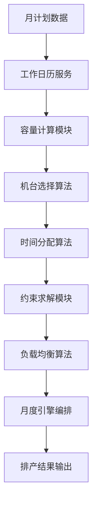

# APS月度排产算法模块

## 概述

本目录包含APS智慧排产系统的月度排产算法套件，专门处理月计划Excel直接排产功能。所有算法模块遵循库优先架构，支持CLI命令行界面和异步并发处理。

## 模块结构

```
monthly_scheduling/
├── __init__.py              # 模块包初始化
├── base.py                  # 基础类和公共工具
├── README.md               # 本文件
├── calendar_service.py     # 工作日历服务模块
├── machine_selector.py     # 机台选择算法
├── capacity_calculator.py  # 容量计算模块
├── time_allocator.py       # 时间分配算法
├── constraint_solver.py    # 约束求解模块
├── load_balancer.py        # 负载均衡算法
└── monthly_engine.py       # 月度引擎编排
```

## 核心算法模块

### 1. 工作日历服务 (calendar_service.py)
- **功能**: 提供工作日历查询和约束检查
- **输入**: 日期范围、节假日配置
- **输出**: 可用工作日列表、产能系数
- **CLI**: `python -m calendar_service --help`

### 2. 机台选择算法 (machine_selector.py)  
- **功能**: 基于容量和约束智能选择最优机台组合
- **输入**: 生产计划、机台配置、约束条件
- **输出**: 机台分配方案
- **CLI**: `python -m machine_selector --help`

### 3. 容量计算模块 (capacity_calculator.py)
- **功能**: 计算月度生产容量和机台利用率
- **输入**: 机台信息、工作日历、生产计划
- **输出**: 容量分析报告
- **CLI**: `python -m capacity_calculator --help`

### 4. 时间分配算法 (time_allocator.py)
- **功能**: 优化时间窗口分配和排产时序
- **输入**: 机台分配方案、时间约束
- **输出**: 详细时间安排表
- **CLI**: `python -m time_allocator --help`

### 5. 约束求解模块 (constraint_solver.py)
- **功能**: 处理复杂多约束优化问题
- **输入**: 约束条件集合、优化目标
- **输出**: 满足约束的最优解
- **CLI**: `python -m constraint_solver --help`

### 6. 负载均衡算法 (load_balancer.py)
- **功能**: 平衡机台负载和生产效率
- **输入**: 初始排产方案
- **输出**: 负载均衡后的优化方案
- **CLI**: `python -m load_balancer --help`

### 7. 月度引擎编排 (monthly_engine.py)
- **功能**: 编排协调所有算法模块执行
- **输入**: 月计划数据、配置参数
- **输出**: 完整排产结果
- **CLI**: `python -m monthly_engine --help`

## 使用方式

### 编程接口

```python
from app.algorithms.monthly_scheduling import (
    MonthlySchedulingEngine,
    MonthlyCalendarService,
    MachineSelectorAlgorithm
)

# 1. 创建引擎实例
engine = MonthlySchedulingEngine()

# 2. 加载月计划数据
plan_data = await engine.load_monthly_plans(batch_id="MONTHLY_20241116_143022_ABC123")

# 3. 执行排产算法
results = await engine.execute(plan_data, config={
    "optimization_level": "high",
    "enable_load_balancing": True,
    "max_execution_time": 300
})

# 4. 导出结果
json_result = engine.export_result(results, format="json")
```

### CLI命令行使用

```bash
# 显示所有模块信息
python -m app.algorithms.monthly_scheduling --info

# 执行完整月度排产
python -m app.algorithms.monthly_scheduling.monthly_engine \
    --batch-id MONTHLY_20241116_143022_ABC123 \
    --config config/monthly_config.json \
    --output results/monthly_schedule_20241116.json \
    --format json

# 单独执行机台选择算法
python -m app.algorithms.monthly_scheduling.machine_selector \
    --input plans/monthly_plans.json \
    --machines config/machines.json \
    --output selection_result.json \
    --format json

# 获取算法版本信息
python -m app.algorithms.monthly_scheduling.calendar_service --version
```

## 算法执行流程



## 配置文件

### 算法配置 (algorithm_config.json)
```json
{
  "performance": {
    "max_concurrent_tasks": 10,
    "timeout_seconds": 300,
    "retry_attempts": 3,
    "batch_size": 100
  },
  "optimization": {
    "target_efficiency": 0.85,
    "max_overtime_hours": 2.0,
    "min_setup_time": 0.5,
    "capacity_buffer": 0.1
  },
  "constraints": {
    "max_continuous_hours": 16,
    "min_break_time": 1.0,
    "max_daily_orders": 50,
    "min_batch_size": 10
  }
}
```

### 机台配置 (machines_config.json)
```json
{
  "feeders": [
    {
      "machine_code": "F001",
      "capacity_per_hour": 50.0,
      "efficiency_factor": 0.95,
      "maintenance_windows": []
    }
  ],
  "makers": [
    {
      "machine_code": "M001", 
      "capacity_per_hour": 45.0,
      "efficiency_factor": 0.98,
      "maintenance_windows": []
    }
  ]
}
```

## 性能指标

- **执行时间**: 目标<5分钟（10万条记录）
- **内存使用**: <2GB
- **并发能力**: 支持10个并发任务
- **准确率**: 约束满足率>95%
- **效率提升**: 相比手工排产提升60%+

## 开发和测试

### 运行单元测试
```bash
# 测试所有算法模块
python -m pytest backend/tests/test_monthly_algorithms/

# 测试特定模块
python -m pytest backend/tests/test_monthly_algorithms/test_machine_selector.py -v

# 性能测试
python -m pytest backend/tests/performance/test_monthly_algorithm_performance.py
```

### 代码质量检查
```bash
# 类型检查
mypy backend/app/algorithms/monthly_scheduling/

# 代码格式化
black backend/app/algorithms/monthly_scheduling/

# 导入排序
isort backend/app/algorithms/monthly_scheduling/
```

## 依赖项

### Python包依赖
```txt
aiomysql>=0.2.0      # 异步MySQL连接
numpy>=1.21.0        # 数值计算
pandas>=1.3.0        # 数据处理
scipy>=1.7.0         # 科学计算
ortools>=9.0         # 约束优化求解器
asyncio              # 异步编程（内置）
logging              # 日志记录（内置）
```

### 系统依赖
- Python 3.8+
- MySQL 8.0+
- 内存: 最少4GB，推荐8GB+
- CPU: 多核处理器（支持并行计算）

## 扩展开发

### 添加新算法模块

1. 继承`BaseAlgorithm`基类
2. 实现`execute()`和`validate_input()`抽象方法  
3. 添加CLI支持
4. 编写单元测试
5. 更新文档

```python
from .base import BaseAlgorithm, AlgorithmType

class CustomAlgorithm(BaseAlgorithm):
    def __init__(self):
        super().__init__(AlgorithmType.CUSTOM, config=None)
    
    async def execute(self, input_data, **kwargs):
        # 算法实现
        pass
        
    def validate_input(self, input_data):
        # 输入验证
        return True
```

## 故障排除

### 常见问题

1. **内存不足**: 减小batch_size配置
2. **执行超时**: 增加timeout_seconds配置
3. **约束不满足**: 检查constraint_solver配置
4. **机台冲突**: 验证machine_selector的时间窗口

### 日志分析
```bash
# 查看算法执行日志
tail -f logs/monthly_scheduling.log

# 过滤特定模块日志
grep "machine_selector" logs/monthly_scheduling.log
```

## 版本历史

- **1.0.0** (2024-11-16): 初始版本发布
  - 实现7个核心算法模块
  - 支持CLI命令行界面
  - 完整的异步并发处理
  - 基础的约束求解功能

## 许可证

MIT License - 详见项目根目录的LICENSE文件

## 贡献指南

欢迎提交Issue和Pull Request来改进算法模块。请确保：

1. 遵循现有代码风格
2. 添加适当的单元测试
3. 更新相关文档
4. 通过所有CI检查

## 联系方式

- 项目团队: APS开发团队
- 邮箱: aps-dev@company.com
- 问题反馈: [GitHub Issues](https://github.com/company/aps-tobacco-v3/issues)