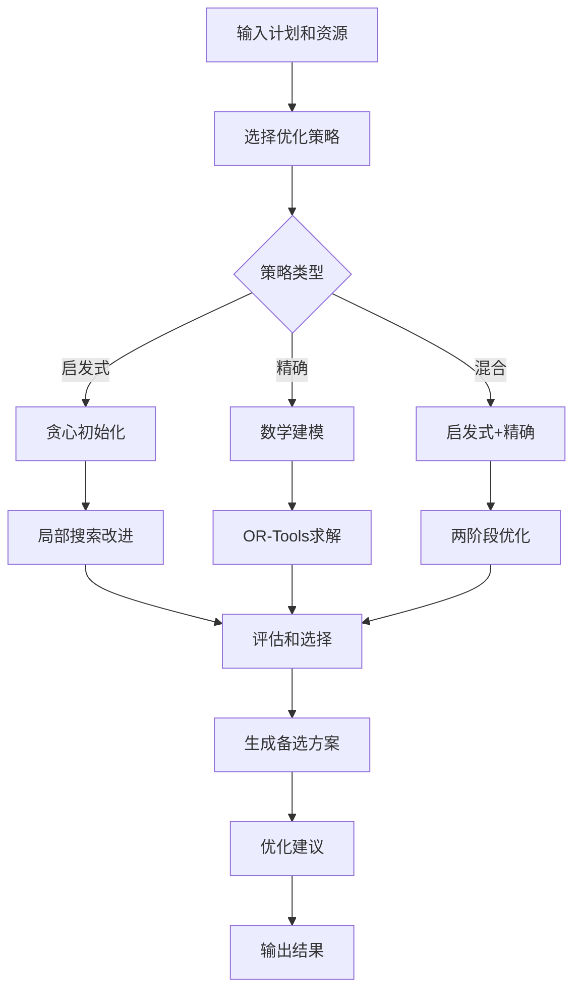

# 月度资源优化算法模块 T024 技术文档

## 概述

月度资源优化算法模块 (T024) 是APS智慧排产系统中的核心优化引擎，专门设计用于烟草生产环境中的智能资源分配、多目标优化和约束求解。该模块实现了启发式算法、精确算法和混合策略的完整解决方案，支持实时调整和动态优化。

## 🎯 核心特性

### 1. 多目标优化支持
- **产能最大化** (Capacity Maximization)
- **成本最小化** (Cost Minimization) 
- **负载均衡** (Load Balancing)
- **效率最大化** (Efficiency Maximization)
- **交期优化** (Deadline Optimization)
- **能耗最小化** (Energy Minimization)

### 2. 智能算法策略
- **启发式算法** (Heuristic): 快速生成可行解，适合大规模问题
- **精确算法** (Exact): 基于OR-Tools的数学优化，保证最优解
- **混合策略** (Hybrid): 结合启发式和精确算法优势

### 3. 全面约束处理
- **机台容量约束** (Machine Capacity)
- **维护时间窗约束** (Maintenance Window)
- **原料供应约束** (Material Supply)
- **人员配置约束** (Workforce Availability)
- **生产顺序约束** (Production Sequence)
- **质量要求约束** (Quality Requirements)

### 4. 实时动态调整
- **增量调整**: 处理小规模变更
- **全局重优化**: 处理大规模变更
- **紧急插单处理**: 支持高优先级任务
- **设备故障响应**: 快速资源重分配

## 🏗️ 架构设计

### 核心类结构

```python
MonthlyResourceOptimizer
├── HeuristicOptimizer          # 启发式优化器
├── ExactOptimizer             # 精确优化器  
├── HybridOptimizer            # 混合优化器
└── 辅助类
    ├── ResourceCapacity       # 资源容量数据
    ├── OptimizationConstraint # 优化约束
    ├── ResourceAllocation     # 资源分配结果
    └── OptimizationResult     # 优化结果
```

### 算法流程



## 📊 数据模型

### 资源容量 (ResourceCapacity)
```python
@dataclass
class ResourceCapacity:
    resource_id: str                # 资源ID
    resource_type: ResourceType     # 资源类型
    resource_name: str              # 资源名称
    total_capacity: Decimal         # 总容量
    available_capacity: Decimal     # 可用容量
    cost_per_unit: Decimal         # 单位成本
    efficiency_factor: float       # 效率因子
    maintenance_windows: List[Tuple[datetime, datetime]]  # 维护窗口
```

### 优化约束 (OptimizationConstraint)
```python
@dataclass  
class OptimizationConstraint:
    constraint_id: str              # 约束ID
    constraint_type: ConstraintType # 约束类型
    affected_resources: List[str]   # 受影响资源
    violation_penalty: float        # 违反惩罚
    hard_constraint: bool          # 是否硬约束
    priority: int                  # 优先级
```

### 分配结果 (ResourceAllocation)
```python
@dataclass
class ResourceAllocation:
    allocation_id: str              # 分配方案ID
    resource_allocations: Dict      # 具体分配
    objective_values: Dict          # 目标函数值
    constraint_violations: Dict     # 约束违反
    optimization_score: float      # 优化评分
    total_cost: Decimal            # 总成本
```

## 🔧 核心算法

### 1. 启发式优化算法

#### 贪心初始化
```python
async def _generate_initial_allocation(self, resources, plans):
    """
    基于优先级的贪心分配策略
    1. 按优先级排序计划项
    2. 为每个计划选择最适合的资源
    3. 考虑容量和成本约束
    """
```

#### 局部搜索改进
```python
async def _local_search_improvement(self, allocation, resources):
    """
    多种改进操作的组合:
    - 交换资源分配 (Swap)
    - 重新分配负载 (Redistribute)  
    - 优化时间窗口 (Time Window)
    """
```

### 2. 精确优化算法

#### 数学建模
```python
# 决策变量
x[i,j] = 1 if 计划i分配给资源j, else 0
c[i,j] = 计划i在资源j上的分配容量
t_start[i], t_end[i] = 计划i的开始和结束时间

# 目标函数
maximize: Σ w_k * f_k(x, c, t)

# 约束条件
Σ_j x[i,j] >= 1                    # 每个计划必须分配
Σ_i c[i,j] <= Cap_j                # 资源容量约束
t_end[i] >= t_start[i] + d_i        # 时间约束
维护时间窗约束                       # 维护期间不可用
```

### 3. 混合优化策略

```python
async def optimize(self, ...):
    """
    两阶段优化:
    1. 启发式算法 (30%时间) - 快速获得初始解
    2. 精确算法 (70%时间) - 在初始解基础上改进
    
    选择更优的解作为最终结果
    """
```

## 🎛️ 参数配置

### 算法参数
```python
ALGORITHM_CONFIG = {
    "performance": {
        "max_concurrent_tasks": 10,
        "timeout_seconds": 300,
        "retry_attempts": 3,
        "batch_size": 100
    },
    "optimization": {
        "target_efficiency": 0.85,
        "max_overtime_hours": 2.0,
        "min_setup_time": 0.5,
        "capacity_buffer": 0.1
    }
}
```

### 优化目标权重
```python
default_objectives = {
    OptimizationObjective.CAPACITY_MAXIMIZATION: 0.4,
    OptimizationObjective.LOAD_BALANCING: 0.3,
    OptimizationObjective.COST_MINIMIZATION: 0.2,
    OptimizationObjective.EFFICIENCY_MAXIMIZATION: 0.1
}
```

## 📈 性能指标

### 优化质量评估
- **综合评分**: 加权多目标函数值
- **可行性评分**: 约束满足程度
- **效率评分**: 资源利用率
- **均衡评分**: 负载分布均匀性
- **成本效率**: 单位成本产出

### 算法性能指标
- **执行时间**: 优化算法运行时间
- **收敛速度**: 达到最优解的迭代次数
- **解的质量**: 与理论最优解的接近程度
- **可扩展性**: 处理大规模问题的能力

## 🚀 使用示例

### 基础优化
```python
# 创建优化器
optimizer = MonthlyResourceOptimizer()

# 定义优化目标
objectives = {
    OptimizationObjective.CAPACITY_MAXIMIZATION: 0.4,
    OptimizationObjective.LOAD_BALANCING: 0.3,
    OptimizationObjective.COST_MINIMIZATION: 0.3
}

# 执行优化
result = await optimizer.optimize_resource_allocation(
    plans=monthly_plans,
    objectives=objectives,
    strategy=AlgorithmStrategy.HYBRID,
    time_limit=300
)

print(f"优化评分: {result.best_allocation.optimization_score}")
print(f"总成本: {result.best_allocation.total_cost}")
```

### 负载均衡
```python
# 平衡工作负载
balanced_allocation = await optimizer.balance_workload(
    current_allocation=current_allocation,
    resources=resources,
    balance_threshold=0.1
)
```

### 实时调整
```python
# 处理生产变更
changes = {
    'new_plans': [urgent_plan],
    'resource_changes': [equipment_maintenance],
    'cancelled_plans': [cancelled_plan_id]
}

adjusted_allocation = await optimizer.real_time_adjustment(
    current_allocation=current_allocation,
    changes=changes,
    adjustment_strategy="incremental"
)
```

## 📊 CLI工具使用

### 基本命令
```bash
# 基础优化
python monthly_resource_optimizer.py --plans data/plans.json

# 指定策略和目标
python monthly_resource_optimizer.py \
    --plans data/plans.json \
    --strategy hybrid \
    --objectives capacity_max:0.4,load_balance:0.3,cost_min:0.3

# 性能基准测试
python monthly_resource_optimizer.py --benchmark

# 生成示例数据
python monthly_resource_optimizer.py --generate-sample
```

### 输出格式
```bash
# 控制台输出
python monthly_resource_optimizer.py --plans data/plans.json --output console

# JSON格式
python monthly_resource_optimizer.py --plans data/plans.json --output json

# 保存到文件
python monthly_resource_optimizer.py --plans data/plans.json --output file --output-file result.json
```

## 🔧 配置和扩展

### 添加新的优化目标
```python
class NewObjective(Enum):
    SUSTAINABILITY = "sustainability"

# 在算法中实现目标函数
def _calculate_sustainability_score(self, allocation):
    # 实现可持续性评分计算
    pass
```

### 添加新的约束类型
```python
class NewConstraintType(Enum):
    ENVIRONMENTAL = "environmental"

# 实现约束评估
def _evaluate_environmental_constraint(self, allocation):
    # 实现环境约束检查
    pass
```

### 自定义优化算法
```python
class CustomOptimizer(ResourceOptimizationAlgorithm):
    async def optimize(self, resources, constraints, objectives, plans):
        # 实现自定义优化逻辑
        pass
```

## 📋 依赖要求

### 必需依赖
```txt
sqlalchemy>=2.0.23    # 数据库ORM
asyncio               # 异步编程
numpy>=1.24.0         # 数值计算
```

### 可选依赖
```txt
ortools>=9.4          # 精确优化 (推荐)
pandas>=1.5.0         # 数据处理
matplotlib>=3.6.0     # 可视化
```

### 安装命令
```bash
# 基础安装
pip install sqlalchemy numpy

# 完整安装 (包含OR-Tools)
pip install sqlalchemy numpy ortools pandas matplotlib
```

## 🧪 测试和验证

### 单元测试
```bash
# 运行所有测试
python -m pytest tests/test_monthly_resource_optimizer.py

# 运行特定测试
python tests/test_monthly_resource_optimizer.py
```

### 性能测试
```bash
# 性能基准测试
python monthly_resource_optimizer.py --benchmark

# 演示功能
python docs/monthly_resource_optimizer_demo.py
```

### 测试覆盖率
- 算法正确性测试
- 性能基准测试
- 边界条件测试
- 异常处理测试
- 集成测试

## 📝 最佳实践

### 1. 参数调优
- 根据具体业务场景调整目标权重
- 设置合理的时间限制
- 选择合适的算法策略

### 2. 性能优化
- 对于大规模问题，优先使用启发式算法
- 利用缓存机制避免重复计算
- 合理设置并发数量

### 3. 约束设计
- 硬约束确保可行性
- 软约束提供优化空间
- 设置合理的违反惩罚

### 4. 结果分析
- 关注多个评估指标
- 分析约束违反情况
- 考虑备选方案

## 🔮 未来发展

### 计划功能
- **机器学习增强**: 基于历史数据的参数自适应
- **多阶段优化**: 支持长期规划和短期调整
- **不确定性处理**: 随机优化和鲁棒优化
- **可视化界面**: Web界面和图表展示

### 性能改进
- **并行计算**: 多核和分布式优化
- **近似算法**: 更快的近似解算法
- **增量优化**: 更高效的实时调整
- **内存优化**: 大规模问题的内存管理

## 📞 支持和维护

### 技术支持
- 邮箱: aps-support@company.com
- 文档: [项目Wiki](内部链接)
- 问题反馈: [GitHub Issues](项目链接)

### 版本信息
- 当前版本: 1.0.0
- 发布日期: 2024年
- 下一版本: 1.1.0 (计划)

---

**注意**: 本文档描述的是T024月度资源优化算法模块的技术实现。使用前请确保了解烟草生产的具体业务需求和约束条件。