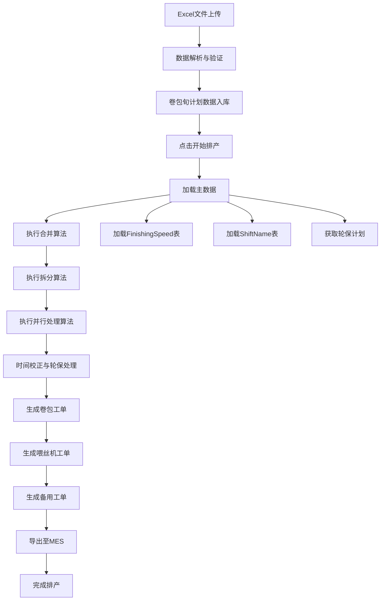

# APS智慧排产系统 - 业务需求与核心算法设计文档

## 1. 概述

本文档基于APS智慧排产思路PRD文档第3章详细解决方案，详细设计系统的功能清单、业务规则和核心算法逻辑，确保系统能够准确实现卷包段排产校正的业务目标。

## 2. 功能模块架构

### 2.1 系统功能分解

```
APS智慧排产系统
├── 数据管理模块
│   ├── Excel文件导入处理
│   ├── 数据验证与清洗
│   └── 主数据管理（设备、物料、BOM）
├── 排产算法模块
│   ├── 卷包计划合并算法
│   ├── 工单拆分算法
│   ├── 并行处理算法
│   └── 时间校正算法
├── 工单管理模块
│   ├── 卷包工单生成
│   ├── 喂丝机工单生成
│   └── 备用工单处理
├── 业务规则引擎
│   ├── 生产速度计算（FinishingSpeed表）
│   ├── 班次管理（ShiftName表）
│   └── 轮保计划处理
└── MES集成模块
    ├── 工单数据导出
    ├── 状态同步接口
    └── 轮保计划获取
```

### 2.2 核心业务流程

基于PRD 2.2.1的排产流程概览，详细流程如下：



## 3. 核心算法设计

### 3.1 卷包计划合并算法

基于PRD 3.2.3.1的合并原则设计：

#### 3.1.1 合并判断条件

```python
def can_merge_orders(order1, order2):
    """
    判断两个卷包旬计划是否可以合并
    基于PRD 3.2.3.1的合并原则
    """
    return (
        # 条件1：旬计划在同一个月份内
        order1.planned_start.month == order2.planned_start.month and
        order1.planned_start.year == order2.planned_start.year and
        
        # 条件2：喂丝机相同
        order1.feeder_code == order2.feeder_code and
        
        # 条件3：卷包机组相同
        order1.maker_code == order2.maker_code and
        
        # 条件4：成品牌号相同
        order1.article_nr == order2.article_nr
    )
```

#### 3.1.2 合并执行算法

```python
def execute_merge_algorithm(work_orders):
    """
    执行卷包计划合并算法
    基于PRD 3.2.3.1的合并属性规则
    """
    merged_orders = []
    processed = set()
    
    for i, order1 in enumerate(work_orders):
        if i in processed:
            continue
            
        merge_group = [order1]
        processed.add(i)
        
        # 查找可合并的订单
        for j, order2 in enumerate(work_orders[i+1:], i+1):
            if j not in processed and can_merge_orders(order1, order2):
                merge_group.append(order2)
                processed.add(j)
        
        # 执行合并
        if len(merge_group) > 1:
            merged_order = merge_orders(merge_group)
            merged_orders.append(merged_order)
        else:
            merged_orders.append(order1)
    
    return merged_orders

def merge_orders(orders):
    """
    根据PRD 3.2.3.1合并属性规则合并订单
    """
    merged = WorkOrder()
    
    # 合并规则：
    # - 计划开始时间：前一个卷包旬计划的开始时间
    merged.planned_start = min([o.planned_start for o in orders])
    
    # - 计划结束时间：后一个卷包旬计划的结束时间  
    merged.planned_end = max([o.planned_end for o in orders])
    
    # - 数量：两个旬计划数量之和
    merged.quantity_total = sum([o.quantity_total for o in orders])
    
    # - 成品数量：两个旬计划数量之和
    merged.final_quantity = sum([o.final_quantity for o in orders])
    
    # - 喂丝机代码、卷包机组代码：旬计划对应的机组
    merged.feeder_code = orders[0].feeder_code
    merged.maker_code = orders[0].maker_code
    merged.article_nr = orders[0].article_nr
    
    return merged
```

### 3.2 工单拆分算法

基于PRD 3.2.2.3的拆分规则设计：

#### 3.2.1 拆分判断逻辑

```python
def should_split_order(work_order):
    """
    判断工单是否需要拆分
    基于PRD："每个卷包机组对应一个卷包工单"
    """
    # 获取该工单对应的卷包机台列表
    maker_machines = get_maker_machines(work_order.maker_code)
    
    # 如果有多台卷包机，需要拆分
    return len(maker_machines) > 1
```

#### 3.2.2 拆分执行算法

```python
def execute_split_algorithm(work_order):
    """
    执行工单拆分算法
    基于PRD："数量平均分配"的原则
    """
    maker_machines = get_maker_machines(work_order.maker_code)
    split_orders = []
    
    # 计算每台机器的分配数量
    base_quantity = work_order.quantity_total // len(maker_machines)
    remainder = work_order.quantity_total % len(maker_machines)
    
    for i, machine in enumerate(maker_machines):
        split_order = WorkOrder()
        
        # 基本信息继承
        split_order.article_nr = work_order.article_nr
        split_order.feeder_code = work_order.feeder_code
        split_order.maker_code = machine  # 单独的机台代码
        
        # 数量分配：余数分配给前几台机器
        split_order.quantity_total = base_quantity + (1 if i < remainder else 0)
        split_order.final_quantity = split_order.quantity_total  # 按比例计算
        
        # 时间信息：取旬计划的开始结束时间
        split_order.planned_start = work_order.planned_start
        split_order.planned_end = work_order.planned_end
        
        split_orders.append(split_order)
    
    return split_orders
```

### 3.3 并行处理算法

基于PRD 3.2.3.2的并行原则设计：

#### 3.3.1 并行约束分析

```python
def analyze_parallel_constraints(work_orders):
    """
    分析并行约束
    基于PRD："同一工单下，所有喂丝机对应的卷包机台，同时开始，同时结束"
    """
    parallel_groups = {}
    
    # 按工单号分组
    for order in work_orders:
        work_order_nr = order.work_order_nr
        if work_order_nr not in parallel_groups:
            parallel_groups[work_order_nr] = []
        parallel_groups[work_order_nr].append(order)
    
    return parallel_groups
```

#### 3.3.2 并行时间协调算法

```python
def coordinate_parallel_timing(parallel_group):
    """
    协调并行工单的时间
    基于PRD 3.2.3.2并行原则的示例逻辑
    """
    # 获取所有相关机台
    all_machines = []
    for order in parallel_group:
        feeder_machines = get_feeder_machines(order.feeder_code)
        maker_machines = get_maker_machines(order.maker_code)
        all_machines.extend(feeder_machines + maker_machines)
    
    # 检查轮保计划
    maintenance_schedules = get_maintenance_schedules(all_machines)
    
    # 计算统一开始时间
    unified_start_time = calculate_unified_start_time(
        parallel_group, maintenance_schedules
    )
    
    # 计算统一结束时间
    unified_end_time = calculate_unified_end_time(
        parallel_group, maintenance_schedules, unified_start_time
    )
    
    # 应用统一时间
    for order in parallel_group:
        order.planned_start = unified_start_time
        order.planned_end = unified_end_time
    
    return parallel_group

def calculate_unified_start_time(orders, maintenance_schedules):
    """
    计算统一开始时间
    基于PRD示例1：考虑轮保时间的调整
    """
    # 基础开始时间：取最晚的计划开始时间
    base_start_time = max([o.planned_start for o in orders])
    
    # 检查开始阶段是否有轮保冲突
    for machine, schedule in maintenance_schedules.items():
        if schedule.start_time <= base_start_time <= schedule.end_time:
            # 如PRD示例1：卷包机1开始阶段轮保，延后到轮保结束
            base_start_time = max(base_start_time, schedule.end_time)
    
    return base_start_time

def calculate_unified_end_time(orders, maintenance_schedules, start_time):
    """
    计算统一结束时间
    基于PRD示例1：考虑轮保时间的调整
    """
    # 计算理论加工时间
    max_processing_time = 0
    for order in orders:
        processing_time = calculate_processing_time(order)
        max_processing_time = max(max_processing_time, processing_time)
    
    # 基础结束时间
    base_end_time = start_time + timedelta(hours=max_processing_time)
    
    # 检查结束阶段是否有轮保冲突
    for machine, schedule in maintenance_schedules.items():
        if schedule.start_time <= base_end_time <= schedule.end_time:
            # 如PRD示例1：卷包机2结束阶段轮保，提前到轮保开始
            base_end_time = min(base_end_time, schedule.start_time)
    
    return base_end_time
```

#### 3.3.3 跨工单并行处理

基于PRD示例2的逻辑：

```python
def handle_cross_order_parallel(work_orders):
    """
    处理跨工单的并行逻辑
    基于PRD示例2："工单C在卷包机台2,3的开始时间，可以早于卷包机1"
    """
    # 按喂丝机分组分析依赖关系
    feeder_dependencies = analyze_feeder_dependencies(work_orders)
    
    for feeder_code, orders in feeder_dependencies.items():
        # 同一喂丝机的工单必须串行执行
        orders.sort(key=lambda x: x.planned_start)
        
        for i in range(1, len(orders)):
            # 后续工单开始时间不能早于前一个工单结束时间
            if orders[i].planned_start < orders[i-1].planned_end:
                orders[i].planned_start = orders[i-1].planned_end
                
                # 重新计算结束时间
                processing_time = calculate_processing_time(orders[i])
                orders[i].planned_end = orders[i].planned_start + timedelta(hours=processing_time)
    
    return work_orders
```

### 3.4 时间校正算法

基于FinishingSpeed表和ShiftName表的时间计算：

#### 3.4.1 生产速度计算

```python
def calculate_processing_speed(equipment_nr, article_nr):
    """
    计算生产速度
    基于PRD知识表1：FinishingSpeed
    """
    # 优先查找具体机台和产品的配置
    speed = query_finishing_speed(equipment_nr, article_nr)
    
    if speed is None:
        # 查找机台通用配置（ArticleNr = '*'）
        speed = query_finishing_speed(equipment_nr, '*')
    
    if speed is None:
        # 查找全局默认配置（EquipmentNr = '*', ArticleNr = '*'）
        speed = query_finishing_speed('*', '*')
    
    return speed if speed is not None else 8.0  # 默认速度

def query_finishing_speed(equipment_nr, article_nr):
    """
    从FinishingSpeed表查询速度
    """
    # 基于PRD表结构查询
    query = """
        SELECT Speed 
        FROM FinishingSpeed 
        WHERE EquipmentNr = %s AND ArticleNr = %s
    """
    result = execute_query(query, (equipment_nr, article_nr))
    return result[0]['Speed'] if result else None
```

#### 3.4.2 班次时间计算

```python
def calculate_shift_time(machine_name, shift_name):
    """
    计算班次工作时间
    基于PRD知识表2：ShiftName
    """
    # 查询班次定义
    shift_info = query_shift_definition(machine_name, shift_name)
    
    if shift_info is None:
        # 查找通用班次定义（MachineName = '*'）
        shift_info = query_shift_definition('*', shift_name)
    
    if shift_info is None:
        # 使用默认班次时间
        return get_default_shift_time(shift_name)
    
    # 计算基础工作时长
    work_duration = (shift_info['End'] - shift_info['Start']).total_seconds() / 3600
    
    # 如果需要加班，增加加班时间
    if shift_info['IsOTNeeded']:
        ot_duration = shift_info['MaxOTDuration'] / 3600 if shift_info['MaxOTDuration'] else 1.0
        work_duration += ot_duration
    
    return work_duration

def query_shift_definition(machine_name, shift_name):
    """
    从ShiftName表查询班次定义
    """
    query = """
        SELECT ShiftName, MachineName, Start, End, IsOTNeeded, MaxOTDuration
        FROM ShiftName 
        WHERE MachineName = %s AND ShiftName = %s
    """
    result = execute_query(query, (machine_name, shift_name))
    return result[0] if result else None
```

#### 3.4.3 综合时间校正算法

```python
def calculate_adjusted_time(work_order):
    """
    综合时间校正算法
    结合生产速度、班次时间、轮保计划
    """
    # 1. 计算理论生产时间
    processing_speed = calculate_processing_speed(
        work_order.maker_code, 
        work_order.article_nr
    )
    theoretical_time = work_order.quantity_total / processing_speed
    
    # 2. 考虑班次限制
    current_shift = get_current_shift(work_order.planned_start)
    available_shift_time = calculate_shift_time(work_order.maker_code, current_shift)
    
    # 3. 考虑轮保时间影响
    maintenance_time = get_maintenance_time_impact(
        work_order.maker_code,
        work_order.planned_start,
        work_order.planned_end
    )
    
    # 4. 计算实际结束时间
    adjusted_end_time = work_order.planned_start
    remaining_time = theoretical_time
    
    while remaining_time > 0:
        current_date = adjusted_end_time.date()
        daily_available_time = min(remaining_time, available_shift_time)
        
        # 减去当天的轮保时间
        daily_maintenance = get_daily_maintenance_time(
            work_order.maker_code, current_date
        )
        daily_available_time -= daily_maintenance
        
        if daily_available_time > 0:
            remaining_time -= daily_available_time
            adjusted_end_time += timedelta(hours=daily_available_time)
        
        if remaining_time > 0:
            # 跳到下一个工作日
            adjusted_end_time = get_next_work_day(adjusted_end_time)
    
    work_order.planned_end = adjusted_end_time
    return work_order
```

## 4. 业务规则引擎

### 4.1 生产约束规则

```python
class ProductionConstraints:
    """生产约束规则类"""
    
    @staticmethod
    def validate_feeder_maker_relationship(feeder_code, maker_code):
        """验证喂丝机与卷包机的对应关系"""
        # 基于喂丝机与卷包机对应关系表
        valid_relationships = get_feeder_maker_relationships()
        return (feeder_code, maker_code) in valid_relationships
    
    @staticmethod
    def check_capacity_constraint(work_order):
        """检查产能约束"""
        machine_capacity = get_machine_daily_capacity(work_order.maker_code)
        required_capacity = work_order.quantity_total
        
        return required_capacity <= machine_capacity
    
    @staticmethod
    def validate_time_sequence(work_orders):
        """验证时间序列的合理性"""
        # 同一喂丝机的工单不能时间重叠
        feeder_groups = {}
        for order in work_orders:
            if order.feeder_code not in feeder_groups:
                feeder_groups[order.feeder_code] = []
            feeder_groups[order.feeder_code].append(order)
        
        for feeder_code, orders in feeder_groups.items():
            orders.sort(key=lambda x: x.planned_start)
            for i in range(1, len(orders)):
                if orders[i].planned_start < orders[i-1].planned_end:
                    return False, f"喂丝机{feeder_code}工单时间冲突"
        
        return True, "时间序列验证通过"
```

### 4.2 质量控制规则

```python
class QualityControlRules:
    """质量控制规则类"""
    
    @staticmethod
    def calculate_on_time_completion_rate(work_orders):
        """
        计算计划按时完工率
        基于PRD 1.1可量化指标
        """
        total_weight = sum([order.quantity_total for order in work_orders])
        on_time_weight = 0
        
        for order in work_orders:
            # 检查预计完工时间是否早于期限
            if order.planned_end <= order.deadline:
                on_time_weight += order.quantity_total
        
        return (on_time_weight / total_weight) * 100 if total_weight > 0 else 0
    
    @staticmethod
    def calculate_load_balance_score(work_orders):
        """
        计算负荷均衡性得分
        基于PRD 1.1可量化指标："同一班时间内产线的下班时间差异"
        """
        # 按班次分组
        shift_groups = {}
        for order in work_orders:
            shift = get_shift_by_time(order.planned_start)
            if shift not in shift_groups:
                shift_groups[shift] = []
            shift_groups[shift].append(order)
        
        total_variance = 0
        for shift, orders in shift_groups.items():
            end_times = [order.planned_end for order in orders]
            if len(end_times) > 1:
                # 计算同班次内结束时间的方差
                variance = calculate_time_variance(end_times)
                total_variance += variance
        
        # 转换为0-100的得分（方差越小得分越高）
        return max(0, 100 - (total_variance / 3600))  # 小时转换为得分
```

## 5. 工单生成规则

### 5.1 卷包工单生成

```python
def generate_jb_work_orders(work_orders):
    """
    生成卷包工单
    基于PRD："每个卷包机组对应一个卷包工单"
    """
    jb_orders = []
    
    for work_order in work_orders:
        jb_order = JBWorkOrder()
        
        # 基本信息
        jb_order.work_order_nr = work_order.work_order_nr
        jb_order.article_nr = work_order.article_nr
        jb_order.quantity_total = work_order.quantity_total
        jb_order.final_quantity = work_order.final_quantity
        jb_order.maker_code = work_order.maker_code
        jb_order.planned_start = work_order.planned_start
        jb_order.planned_end = work_order.planned_end
        
        jb_orders.append(jb_order)
    
    return jb_orders
```

### 5.2 喂丝机工单生成

```python
def generate_ws_work_orders(work_orders):
    """
    生成喂丝机工单
    基于PRD："喂丝机工单对应卷包旬计划内的所有喂丝机"
    """
    # 按喂丝机代码分组
    feeder_groups = {}
    for work_order in work_orders:
        if work_order.feeder_code not in feeder_groups:
            feeder_groups[work_order.feeder_code] = []
        feeder_groups[work_order.feeder_code].append(work_order)
    
    ws_orders = []
    for feeder_code, orders in feeder_groups.items():
        ws_order = WSWorkOrder()
        
        # 喂丝机工单信息
        ws_order.feeder_code = feeder_code
        ws_order.material_code = get_feeder_material_code(feeder_code)
        
        # 时间范围：涵盖所有关联卷包工单
        ws_order.planned_start = min([o.planned_start for o in orders])
        ws_order.planned_end = max([o.planned_end for o in orders])
        
        # 关联的卷包工单
        ws_order.related_jb_orders = [o.work_order_nr for o in orders]
        
        ws_orders.append(ws_order)
    
    return ws_orders
```

### 5.3 备用工单处理

```python
def generate_backup_orders(work_orders):
    """
    生成备用工单
    基于PRD："对于前后月份，月份不同，牌号不同的工单，需要生成备用工单"
    """
    backup_orders = []
    
    for work_order in work_orders:
        # 检查是否跨月
        if work_order.planned_start.month != work_order.planned_end.month:
            # 创建下月备用工单
            backup_order = create_backup_order(work_order)
            backup_orders.append(backup_order)
    
    return backup_orders

def create_backup_order(original_order):
    """创建备用工单"""
    backup_order = WorkOrder()
    
    # 复制基本信息
    backup_order.work_order_nr = original_order.work_order_nr + "_BACKUP"
    backup_order.article_nr = original_order.article_nr
    backup_order.maker_code = original_order.maker_code
    backup_order.feeder_code = original_order.feeder_code
    
    # 调整时间到下月
    next_month_start = get_next_month_start(original_order.planned_start)
    backup_order.planned_start = next_month_start
    
    # 计算剩余数量
    remaining_quantity = calculate_remaining_quantity(original_order)
    backup_order.quantity_total = remaining_quantity
    backup_order.final_quantity = remaining_quantity
    
    # 重新计算结束时间
    processing_time = calculate_processing_time(backup_order)
    backup_order.planned_end = backup_order.planned_start + timedelta(hours=processing_time)
    
    return backup_order
```

## 6. 系统集成规则

### 6.1 MES接口数据格式

基于PRD 5.1.2的数据对象定义：

```python
def format_mes_export_data(jb_orders, ws_orders):
    """
    格式化MES导出数据
    基于PRD表2卷包机工单结构
    """
    mes_data = {
        "jb_work_orders": [],
        "ws_work_orders": []
    }
    
    # 卷包工单数据
    for order in jb_orders:
        mes_jb_order = {
            "WorkOrderNr": order.work_order_nr,
            "ArticleNr": order.article_nr,
            "QuantityTotal": order.quantity_total,
            "FinalQuantity": order.final_quantity,
            "MakerCode": order.maker_code,
            "PlannedStart": order.planned_start.strftime("%Y-%m-%d %H:%M:%S"),
            "PlannedEnd": order.planned_end.strftime("%Y-%m-%d %H:%M:%S")
        }
        mes_data["jb_work_orders"].append(mes_jb_order)
    
    # 喂丝机工单数据
    for order in ws_orders:
        mes_ws_order = {
            "FeederCode": order.feeder_code,
            "MaterialCode": order.material_code,
            "PlannedStart": order.planned_start.strftime("%Y-%m-%d %H:%M:%S"),
            "PlannedEnd": order.planned_end.strftime("%Y-%m-%d %H:%M:%S"),
            "RelatedJBOrders": order.related_jb_orders
        }
        mes_data["ws_work_orders"].append(mes_ws_order)
    
    return mes_data
```

### 6.2 轮保计划集成

```python
def integrate_maintenance_plan():
    """
    集成轮保计划
    基于PRD 5.1.2.2卷包段轮保接口
    """
    # 从MES获取轮保计划
    maintenance_data = fetch_maintenance_plan_from_mes()
    
    # 解析轮保数据
    maintenance_schedules = {}
    for plan in maintenance_data:
        equipment_position = plan['MaintItem']['EquipmentPosition']
        schedule = {
            'plan_no': plan['MaintPlanNo'],
            'schedule_time': datetime.strptime(plan['ScheduleTime'], "%Y-%m-%d"),
            'shift': plan['Shift'],
            'maint_group': plan['MaintGroup']
        }
        
        if equipment_position not in maintenance_schedules:
            maintenance_schedules[equipment_position] = []
        maintenance_schedules[equipment_position].append(schedule)
    
    return maintenance_schedules

def fetch_maintenance_plan_from_mes():
    """从MES系统获取轮保计划"""
    # 调用MES接口获取轮保计划
    # 基于PRD EMMaintPlan结构
    mes_api_url = get_mes_api_url()
    response = call_mes_api(mes_api_url, "GET_MAINTENANCE_PLAN")
    return response.data
```

## 7. 性能优化策略

### 7.1 算法优化

```python
class AlgorithmOptimizer:
    """算法优化器"""
    
    @staticmethod
    def optimize_merge_algorithm(work_orders):
        """优化合并算法性能"""
        # 使用哈希表加速查找
        order_index = {}
        for i, order in enumerate(work_orders):
            key = (order.feeder_code, order.maker_code, order.article_nr, order.planned_start.month)
            if key not in order_index:
                order_index[key] = []
            order_index[key].append(i)
        
        merged_orders = []
        processed = set()
        
        for key, indices in order_index.items():
            if len(indices) > 1:
                # 多个订单可合并
                orders_to_merge = [work_orders[i] for i in indices if i not in processed]
                if orders_to_merge:
                    merged_order = merge_orders(orders_to_merge)
                    merged_orders.append(merged_order)
                    processed.update(indices)
        
        # 添加未合并的订单
        for i, order in enumerate(work_orders):
            if i not in processed:
                merged_orders.append(order)
        
        return merged_orders
```

### 7.2 缓存策略

```python
class CacheManager:
    """缓存管理器"""
    
    def __init__(self):
        self.speed_cache = {}
        self.shift_cache = {}
    
    def get_processing_speed(self, equipment_nr, article_nr):
        """缓存生产速度查询"""
        cache_key = f"{equipment_nr}_{article_nr}"
        if cache_key not in self.speed_cache:
            speed = calculate_processing_speed(equipment_nr, article_nr)
            self.speed_cache[cache_key] = speed
        return self.speed_cache[cache_key]
    
    def clear_cache(self):
        """清空缓存"""
        self.speed_cache.clear()
        self.shift_cache.clear()
```

## 8. 测试验证

### 8.1 算法单元测试

```python
def test_merge_algorithm():
    """测试合并算法"""
    # 准备测试数据
    order1 = create_test_order("W001", "PA", "FF01", "JJ01", "2024-11-01")
    order2 = create_test_order("W002", "PA", "FF01", "JJ01", "2024-11-02")
    
    # 执行合并
    merged = execute_merge_algorithm([order1, order2])
    
    # 验证结果
    assert len(merged) == 1
    assert merged[0].quantity_total == order1.quantity_total + order2.quantity_total
    assert merged[0].planned_start == min(order1.planned_start, order2.planned_start)
    assert merged[0].planned_end == max(order1.planned_end, order2.planned_end)

def test_parallel_algorithm():
    """测试并行算法"""
    # 准备并行工单数据
    orders = create_parallel_test_orders()
    
    # 执行并行处理
    coordinated = coordinate_parallel_timing(orders)
    
    # 验证同一工单下的机台时间一致
    work_order_groups = {}
    for order in coordinated:
        if order.work_order_nr not in work_order_groups:
            work_order_groups[order.work_order_nr] = []
        work_order_groups[order.work_order_nr].append(order)
    
    for work_order_nr, group in work_order_groups.items():
        start_times = [order.planned_start for order in group]
        end_times = [order.planned_end for order in group]
        
        # 同一工单的所有机台应该同时开始和结束
        assert len(set(start_times)) == 1, f"工单{work_order_nr}开始时间不一致"
        assert len(set(end_times)) == 1, f"工单{work_order_nr}结束时间不一致"
```

## 9. 总结

本文档基于APS智慧排产思路PRD的详细解决方案，设计了完整的业务需求和核心算法体系，包括：

1. **合并算法**：严格按照PRD 3.2.3.1的四个合并条件和属性规则
2. **拆分算法**：基于"每个卷包机组对应一个工单"的原则进行数量平均分配
3. **并行算法**：实现PRD 3.2.3.2的同时开始结束原则，处理轮保时间冲突
4. **时间校正**：结合FinishingSpeed表和ShiftName表进行精确时间计算
5. **工单生成**：按照PRD规范生成卷包工单、喂丝机工单和备用工单

所有算法设计都严格遵循PRD中的业务逻辑和数据结构，确保系统实现的准确性和可靠性。

---

*本文档版本：v1.0*  
*最后更新：2024-08-26*  
*上一个文档：APS-UX-Design.md*  
*下一个文档：APS-Technical-Architecture.md*