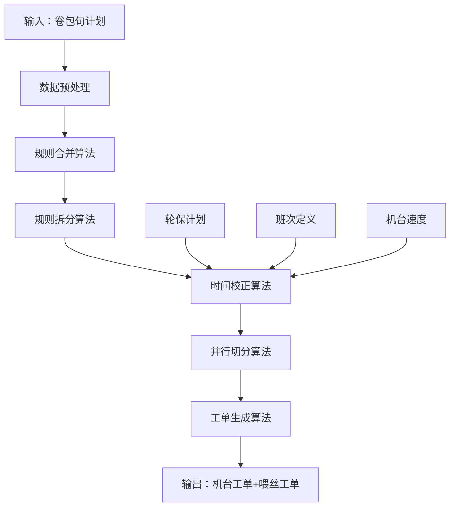

# APS智慧排产系统 - 算法详解文档

## 1. 算法总体架构

### 1.1 算法流程概述



### 1.2 核心算法模块

| 算法模块 | 主要功能 | 输入数据 | 输出数据 | 复杂度 |
|---------|---------|----------|----------|--------|
| **数据预处理** | 数据清洗、验证、标准化 | Excel原始数据 | 标准化计划数据 | O(n) |
| **规则合并** | 按业务规则合并相同条件的旬计划 | 标准化计划数据 | 合并后计划数据 | O(n²) |
| **规则拆分** | 按机台数量拆分工单 | 合并后计划数据 | 拆分后工单数据 | O(n×m) |
| **时间校正** | 考虑轮保、班次等约束校正时间 | 拆分工单+约束条件 | 校正后工单 | O(n×k) |
| **并行切分** | 实现同工单机台同时开始结束 | 校正后工单 | 并行工单组 | O(n³) |
| **工单生成** | 生成最终机台工单和喂丝工单 | 并行工单组 | 最终工单 | O(n) |

*n=工单数量，m=平均机台数，k=平均约束数量*

## 2. 数据预处理算法

### 2.1 数据清洗算法

```python
def data_cleaning(raw_data):
    """
    数据清洗算法
    
    Args:
        raw_data: 从Excel读取的原始数据
        
    Returns:
        cleaned_data: 清洗后的数据
    """
    cleaned_data = []
    
    for record in raw_data:
        # 1. 去除空行和无效数据
        if is_empty_record(record):
            continue
            
        # 2. 标准化字段格式
        record = standardize_fields(record)
        
        # 3. 数据类型转换
        record = convert_data_types(record)
        
        # 4. 业务规则验证
        if validate_business_rules(record):
            cleaned_data.append(record)
        else:
            log_validation_error(record)
            
    return cleaned_data

def standardize_fields(record):
    """字段标准化处理"""
    # 时间格式标准化
    record['PlannedStart'] = parse_datetime(record['PlannedStart'])
    record['PlannedEnd'] = parse_datetime(record['PlannedEnd'])
    
    # 文本字段去除空格
    record['ArticleNr'] = record['ArticleNr'].strip()
    record['MakerCode'] = record['MakerCode'].strip()
    record['FeederCode'] = record['FeederCode'].strip()
    
    # 数值字段处理
    record['QuantityTotal'] = int(record['QuantityTotal'])
    record['FinalQuantity'] = int(record['FinalQuantity'])
    
    return record
```

### 2.2 数据验证算法

```python
def validate_business_rules(record):
    """
    业务规则验证算法
    
    Args:
        record: 单条数据记录
        
    Returns:
        bool: 验证是否通过
    """
    # 1. 时间逻辑验证
    if record['PlannedStart'] >= record['PlannedEnd']:
        return False
        
    # 2. 数量合理性验证  
    quantity_ratio = record['FinalQuantity'] / record['QuantityTotal']
    if not (0.8 <= quantity_ratio <= 1.2):
        return False
        
    # 3. 机台存在性验证
    if not machine_exists(record['MakerCode']):
        return False
        
    if not feeder_exists(record['FeederCode']):
        return False
        
    # 4. 时间范围验证（未来6个月内）
    max_future_date = datetime.now() + timedelta(days=180)
    if record['PlannedEnd'] > max_future_date:
        return False
        
    return True
```

## 3. 规则合并算法

### 3.1 合并条件判定算法

```python
def can_merge(plan1, plan2):
    """
    判定两个旬计划是否可以合并
    
    合并条件（需全部满足）：
    1. 旬计划在同一个月份内
    2. 成品烟牌号相同
    3. 卷包机代码相同
    4. 喂丝机代码相同
    
    Args:
        plan1, plan2: 两个旬计划数据
        
    Returns:
        bool: 是否可以合并
    """
    # 条件1：同一月份
    if plan1['PlannedStart'].month != plan2['PlannedStart'].month:
        return False
    
    if plan1['PlannedStart'].year != plan2['PlannedStart'].year:
        return False
        
    # 条件2：牌号相同
    if plan1['ArticleNr'] != plan2['ArticleNr']:
        return False
        
    # 条件3：卷包机相同
    if plan1['MakerCode'] != plan2['MakerCode']:
        return False
        
    # 条件4：喂丝机相同  
    if plan1['FeederCode'] != plan2['FeederCode']:
        return False
        
    return True
```

### 3.2 合并执行算法

```python
def merge_plans(plans_to_merge):
    """
    执行旬计划合并
    
    Args:
        plans_to_merge: 需要合并的旬计划列表
        
    Returns:
        merged_plan: 合并后的计划
    """
    if len(plans_to_merge) <= 1:
        return plans_to_merge[0] if plans_to_merge else None
        
    # 初始化合并结果
    merged_plan = plans_to_merge[0].copy()
    
    # 生成新的合并订单号
    merge_date = datetime.now().strftime("%Y%m%d")
    merged_plan['WorkOrderNr'] = f"M{merge_date}{get_next_sequence()}"
    
    # 时间属性合并
    merged_plan['PlannedStart'] = min(p['PlannedStart'] for p in plans_to_merge)
    merged_plan['PlannedEnd'] = max(p['PlannedEnd'] for p in plans_to_merge)
    
    # 数量属性累加
    merged_plan['QuantityTotal'] = sum(p['QuantityTotal'] for p in plans_to_merge)
    merged_plan['FinalQuantity'] = sum(p['FinalQuantity'] for p in plans_to_merge)
    
    # 记录合并历史
    merged_plan['MergedFrom'] = [p['WorkOrderNr'] for p in plans_to_merge]
    merged_plan['MergeTimestamp'] = datetime.now()
    
    return merged_plan
```

### 3.3 合并组识别算法

```python
def identify_merge_groups(plans):
    """
    识别可以合并的计划组
    
    使用Union-Find算法识别连通分量
    
    Args:
        plans: 所有旬计划数据
        
    Returns:
        merge_groups: 合并组列表
    """
    n = len(plans)
    parent = list(range(n))
    
    def find(x):
        if parent[x] != x:
            parent[x] = find(parent[x])
        return parent[x]
    
    def union(x, y):
        px, py = find(x), find(y)
        if px != py:
            parent[px] = py
    
    # 构建合并关系
    for i in range(n):
        for j in range(i + 1, n):
            if can_merge(plans[i], plans[j]):
                union(i, j)
    
    # 分组结果
    groups = defaultdict(list)
    for i in range(n):
        groups[find(i)].append(plans[i])
    
    return list(groups.values())
```

## 4. 规则拆分算法

### 4.1 拆分需求判定算法

```python
def need_split(merged_plan):
    """
    判定是否需要拆分工单
    
    拆分条件：
    1. 一个喂丝机对应多台卷包机
    2. 工单数量超过单台机台处理能力
    3. 时间跨度超过单个班次时长
    
    Args:
        merged_plan: 合并后的计划数据
        
    Returns:
        bool: 是否需要拆分
    """
    # 获取对应的卷包机列表
    maker_codes = get_maker_codes_by_feeder(merged_plan['FeederCode'])
    
    # 条件1：多台卷包机
    if len(maker_codes) > 1:
        return True
        
    # 条件2：数量超限
    single_machine_capacity = get_machine_capacity(maker_codes[0])
    if merged_plan['QuantityTotal'] > single_machine_capacity:
        return True
        
    # 条件3：时间超限
    time_duration = merged_plan['PlannedEnd'] - merged_plan['PlannedStart']
    max_shift_duration = timedelta(hours=8)
    if time_duration > max_shift_duration:
        return True
        
    return False
```

### 4.2 数量分配算法

```python
def allocate_quantity(total_quantity, machine_codes):
    """
    按卷包机数量分配投料数量
    
    分配原则：
    1. 按机台数量平均分配
    2. 余数按机台编号顺序分配
    3. 确保每台机台分配量>0
    
    Args:
        total_quantity: 总投料量
        machine_codes: 卷包机代码列表
        
    Returns:
        dict: {机台代码: 分配数量}
    """
    machine_count = len(machine_codes)
    base_quantity = total_quantity // machine_count
    remainder = total_quantity % machine_count
    
    allocation = {}
    
    # 排序确保分配顺序一致
    sorted_machines = sorted(machine_codes)
    
    for i, machine_code in enumerate(sorted_machines):
        allocation[machine_code] = base_quantity
        # 余数按顺序分配
        if i < remainder:
            allocation[machine_code] += 1
            
    return allocation
```

### 4.3 工单拆分执行算法

```python
def split_work_order(merged_plan):
    """
    执行工单拆分
    
    Args:
        merged_plan: 需要拆分的合并计划
        
    Returns:
        list: 拆分后的工单列表
    """
    # 获取对应的卷包机列表
    maker_codes = get_maker_codes_by_feeder(merged_plan['FeederCode'])
    
    # 数量分配
    quantity_allocation = allocate_quantity(
        merged_plan['QuantityTotal'], 
        maker_codes
    )
    
    final_quantity_allocation = allocate_quantity(
        merged_plan['FinalQuantity'],
        maker_codes
    )
    
    # 生成拆分工单
    split_orders = []
    
    for i, maker_code in enumerate(sorted(maker_codes)):
        split_order = merged_plan.copy()
        
        # 更新工单标识
        split_order['WorkOrderNr'] = f"{merged_plan['WorkOrderNr']}-{i+1:02d}"
        split_order['MakerCode'] = maker_code
        
        # 更新数量
        split_order['QuantityTotal'] = quantity_allocation[maker_code]
        split_order['FinalQuantity'] = final_quantity_allocation[maker_code]
        
        # 保持时间不变（同时开始，同时结束）
        split_order['PlannedStart'] = merged_plan['PlannedStart']
        split_order['PlannedEnd'] = merged_plan['PlannedEnd']
        
        # 记录拆分历史
        split_order['SplitFrom'] = merged_plan['WorkOrderNr']
        split_order['SplitIndex'] = i + 1
        split_order['SplitTimestamp'] = datetime.now()
        
        split_orders.append(split_order)
    
    return split_orders
```

## 5. 时间校正算法

### 5.1 轮保冲突检测算法

```python
def detect_maintenance_conflicts(work_order, maintenance_plans):
    """
    检测工单与轮保计划的时间冲突
    
    Args:
        work_order: 工单数据
        maintenance_plans: 轮保计划列表
        
    Returns:
        list: 冲突的轮保计划列表
    """
    conflicts = []
    
    work_start = work_order['PlannedStart']
    work_end = work_order['PlannedEnd']
    machine_code = work_order['MakerCode']
    
    for maint_plan in maintenance_plans:
        # 只检查相同机台的轮保
        if maint_plan['EquipmentPosition'] != machine_code:
            continue
            
        maint_start = parse_maintenance_time(maint_plan)
        maint_end = maint_start + get_maintenance_duration(maint_plan)
        
        # 检测时间重叠
        if time_overlap(work_start, work_end, maint_start, maint_end):
            conflicts.append(maint_plan)
            
    return conflicts

def time_overlap(start1, end1, start2, end2):
    """判定两个时间段是否重叠"""
    return not (end1 <= start2 or end2 <= start1)
```

### 5.2 时间校正执行算法

```python
def correct_work_order_time(work_order, maintenance_plans):
    """
    执行工单时间校正
    
    校正策略：
    1. 如开始时间冲突，延后到轮保结束后
    2. 如结束时间冲突，提前到轮保开始前  
    3. 如完全覆盖，整个工单延期到轮保后
    4. 重新计算实际可生产时间
    
    Args:
        work_order: 需要校正的工单
        maintenance_plans: 轮保计划列表
        
    Returns:
        corrected_order: 校正后的工单
    """
    conflicts = detect_maintenance_conflicts(work_order, maintenance_plans)
    
    if not conflicts:
        return work_order
        
    corrected_order = work_order.copy()
    
    for conflict in conflicts:
        maint_start = parse_maintenance_time(conflict)
        maint_end = maint_start + get_maintenance_duration(conflict)
        
        work_start = corrected_order['PlannedStart']
        work_end = corrected_order['PlannedEnd']
        work_duration = work_end - work_start
        
        # 策略选择
        if work_start >= maint_start and work_end <= maint_end:
            # 完全覆盖：延期到轮保后
            corrected_order['PlannedStart'] = maint_end
            corrected_order['PlannedEnd'] = maint_end + work_duration
            
        elif work_start < maint_start and work_end > maint_end:
            # 轮保在工单中间：分割处理
            # 简化处理：延期到轮保后
            corrected_order['PlannedStart'] = maint_end  
            corrected_order['PlannedEnd'] = maint_end + work_duration
            
        elif work_start < maint_start < work_end:
            # 结束时间冲突：提前结束
            corrected_order['PlannedEnd'] = maint_start
            
        elif work_start < maint_end < work_end:
            # 开始时间冲突：延后开始
            corrected_order['PlannedStart'] = maint_end
            corrected_order['PlannedEnd'] = maint_end + work_duration
    
    # 记录校正历史
    corrected_order['TimeCorrection'] = {
        'original_start': work_order['PlannedStart'],
        'original_end': work_order['PlannedEnd'],
        'conflicts': len(conflicts),
        'correction_timestamp': datetime.now()
    }
    
    return corrected_order
```

### 5.3 班次时间校正算法

```python
def correct_shift_time(work_order):
    """
    班次时间校正算法
    
    班次定义：
    - 早班：6:40-15:40
    - 中班：15:40-24:00
    
    Args:
        work_order: 需要校正的工单
        
    Returns:
        corrected_order: 班次校正后的工单
    """
    shifts = [
        {'name': 'EARLY', 'start': time(6, 40), 'end': time(15, 40)},
        {'name': 'MIDDLE', 'start': time(15, 40), 'end': time(24, 0)}
    ]
    
    work_start = work_order['PlannedStart']
    work_end = work_order['PlannedEnd']
    
    # 检查是否跨越非连续班次
    start_shift = get_shift_by_time(work_start.time(), shifts)
    end_shift = get_shift_by_time(work_end.time(), shifts)
    
    corrected_order = work_order.copy()
    
    # 如果跨越非连续班次，需要调整
    if not is_continuous_shifts(start_shift, end_shift):
        # 调整到最近的连续班次边界
        corrected_order = adjust_to_shift_boundary(corrected_order, shifts)
    
    return corrected_order

def get_shift_by_time(time_obj, shifts):
    """根据时间确定所属班次"""
    for shift in shifts:
        if shift['start'] <= time_obj < shift['end']:
            return shift
    return None
```

## 6. 并行切分算法

### 6.1 并行约束检测算法

```python
def detect_parallel_constraints(work_orders):
    """
    检测并行约束条件
    
    约束条件：
    1. 同一工单下所有卷包机必须同时开始
    2. 同一工单下所有卷包机必须同时结束  
    3. 同一喂丝机的不同工单不能时间重叠
    
    Args:
        work_orders: 工单列表
        
    Returns:
        dict: 约束检测结果
    """
    constraints = {
        'parallel_groups': {},  # 需要并行的工单组
        'sequential_chains': {},  # 需要顺序执行的工单链
        'conflicts': []  # 时间冲突列表
    }
    
    # 按原始工单号分组（同一工单的拆分）
    original_groups = defaultdict(list)
    for order in work_orders:
        original_nr = order.get('SplitFrom', order['WorkOrderNr'])
        original_groups[original_nr].append(order)
    
    # 识别并行组
    for original_nr, orders in original_groups.items():
        if len(orders) > 1:
            constraints['parallel_groups'][original_nr] = orders
    
    # 按喂丝机分组检测顺序约束
    feeder_groups = defaultdict(list)
    for order in work_orders:
        feeder_groups[order['FeederCode']].append(order)
    
    for feeder_code, orders in feeder_groups.items():
        # 按开始时间排序
        sorted_orders = sorted(orders, key=lambda x: x['PlannedStart'])
        constraints['sequential_chains'][feeder_code] = sorted_orders
        
        # 检测时间冲突
        for i in range(len(sorted_orders) - 1):
            current = sorted_orders[i]
            next_order = sorted_orders[i + 1]
            
            if current['PlannedEnd'] > next_order['PlannedStart']:
                constraints['conflicts'].append({
                    'type': 'TIME_OVERLAP',
                    'feeder': feeder_code,
                    'order1': current['WorkOrderNr'],
                    'order2': next_order['WorkOrderNr']
                })
    
    return constraints
```

### 6.2 并行时间协调算法

```python
def coordinate_parallel_timing(parallel_groups):
    """
    协调并行工单的时间安排
    
    协调策略：
    1. 找到所有机台的最晚开始时间作为统一开始时间
    2. 找到所有机台的最早结束时间作为统一结束时间
    3. 处理轮保等特殊情况
    
    Args:
        parallel_groups: 需要并行的工单组
        
    Returns:
        dict: 协调后的工单组
    """
    coordinated_groups = {}
    
    for group_id, orders in parallel_groups.items():
        if len(orders) <= 1:
            coordinated_groups[group_id] = orders
            continue
            
        # 收集所有机台的时间约束
        machine_constraints = []
        
        for order in orders:
            machine_code = order['MakerCode']
            
            # 获取机台的轮保约束
            maint_plans = get_maintenance_plans(machine_code)
            corrected_order = correct_work_order_time(order, maint_plans)
            
            machine_constraints.append({
                'machine': machine_code,
                'earliest_start': corrected_order['PlannedStart'],
                'latest_end': corrected_order['PlannedEnd'],
                'original_duration': (
                    order['PlannedEnd'] - order['PlannedStart']
                )
            })
        
        # 找到协调后的统一时间
        unified_start = max(c['earliest_start'] for c in machine_constraints)
        
        # 计算所需的总时间（考虑最大工作量）
        max_duration = max(c['original_duration'] for c in machine_constraints)
        unified_end = unified_start + max_duration
        
        # 验证所有机台都能在统一时间内完成
        feasible = True
        for constraint in machine_constraints:
            if unified_end > constraint['latest_end']:
                feasible = False
                break
        
        # 如果不可行，寻找替代方案
        if not feasible:
            # 延期到所有约束都满足的时间点
            unified_start = find_feasible_start_time(machine_constraints)
            unified_end = unified_start + max_duration
        
        # 更新所有工单的时间
        coordinated_orders = []
        for order in orders:
            coordinated_order = order.copy()
            coordinated_order['PlannedStart'] = unified_start
            coordinated_order['PlannedEnd'] = unified_end
            
            # 记录协调历史
            coordinated_order['ParallelCoordination'] = {
                'original_start': order['PlannedStart'],
                'original_end': order['PlannedEnd'], 
                'group_id': group_id,
                'coordination_timestamp': datetime.now()
            }
            
            coordinated_orders.append(coordinated_order)
        
        coordinated_groups[group_id] = coordinated_orders
    
    return coordinated_groups
```

### 6.3 顺序调度算法

```python
def schedule_sequential_orders(sequential_chains):
    """
    顺序调度算法
    
    调度策略：
    1. 按优先级和开始时间排序
    2. 确保前一工单结束后至少间隔15分钟
    3. 考虑机台切换时间
    
    Args:
        sequential_chains: 需要顺序执行的工单链
        
    Returns:
        dict: 调度后的工单链
    """
    scheduled_chains = {}
    MIN_INTERVAL = timedelta(minutes=15)  # 最小间隔时间
    
    for feeder_code, orders in sequential_chains.items():
        if len(orders) <= 1:
            scheduled_chains[feeder_code] = orders
            continue
            
        # 按优先级和计划时间排序
        sorted_orders = sorted(orders, key=lambda x: (
            x.get('Priority', 5),  # 优先级（数值越小优先级越高）
            x['PlannedStart']      # 计划开始时间
        ))
        
        scheduled_orders = []
        current_time = None
        
        for order in sorted_orders:
            scheduled_order = order.copy()
            original_duration = order['PlannedEnd'] - order['PlannedStart']
            
            # 确定开始时间
            if current_time is None:
                # 第一个工单
                start_time = order['PlannedStart']
            else:
                # 后续工单：至少间隔15分钟
                earliest_start = current_time + MIN_INTERVAL
                planned_start = order['PlannedStart']
                start_time = max(earliest_start, planned_start)
            
            # 更新时间
            scheduled_order['PlannedStart'] = start_time
            scheduled_order['PlannedEnd'] = start_time + original_duration
            
            # 记录调度历史
            scheduled_order['SequentialScheduling'] = {
                'original_start': order['PlannedStart'],
                'original_end': order['PlannedEnd'],
                'feeder_code': feeder_code,
                'sequence_index': len(scheduled_orders),
                'scheduling_timestamp': datetime.now()
            }
            
            scheduled_orders.append(scheduled_order)
            current_time = scheduled_order['PlannedEnd']
        
        scheduled_chains[feeder_code] = scheduled_orders
    
    return scheduled_chains
```

## 7. 工单生成算法

### 7.1 卷包机工单生成算法

```python
def generate_packing_orders(coordinated_work_orders):
    """
    生成卷包机工单
    
    Args:
        coordinated_work_orders: 协调后的工单数据
        
    Returns:
        list: 卷包机工单列表
    """
    packing_orders = []
    
    for order in coordinated_work_orders:
        packing_order = {
            # 基本信息
            'WorkOrderNr': generate_packing_order_nr(),
            'WorkOrderType': 'PACKING',
            'OriginalOrderNr': order['WorkOrderNr'],
            
            # 产品信息  
            'ArticleNr': order['ArticleNr'],
            'QuantityTotal': order['QuantityTotal'],
            'FinalQuantity': order['FinalQuantity'],
            
            # 机台信息
            'MakerCode': order['MakerCode'],
            'MachineType': get_machine_type(order['MakerCode']),
            
            # 时间信息
            'PlannedStart': order['PlannedStart'],
            'PlannedEnd': order['PlannedEnd'],
            'EstimatedDuration': order['PlannedEnd'] - order['PlannedStart'],
            
            # 状态信息
            'Status': 'PLANNED',
            'Priority': order.get('Priority', 5),
            
            # 生产参数
            'ProductionSpeed': get_production_speed(
                order['MakerCode'], 
                order['ArticleNr']
            ),
            'WorkingShifts': get_working_shifts(order),
            
            # 关联信息
            'FeederCode': order['FeederCode'],
            'RelatedFeederOrder': None,  # 后续关联
            
            # 审计信息
            'CreatedTime': datetime.now(),
            'CreatedBy': 'APS_SYSTEM',
            'ProcessingHistory': order.get('ProcessingHistory', [])
        }
        
        # 添加特殊处理标记
        if order.get('SplitFrom'):
            packing_order['IsSplitOrder'] = True
            packing_order['SplitFrom'] = order['SplitFrom']
            packing_order['SplitIndex'] = order['SplitIndex']
            
        if order.get('MergedFrom'):
            packing_order['IsMergedOrder'] = True
            packing_order['MergedFrom'] = order['MergedFrom']
        
        packing_orders.append(packing_order)
    
    return packing_orders

def generate_packing_order_nr():
    """生成卷包机工单号"""
    date_str = datetime.now().strftime("%Y%m%d")
    sequence = get_next_packing_sequence()
    return f"JJ{date_str}{sequence:04d}"
```

### 7.2 喂丝机工单生成算法

```python
def generate_feeding_orders(packing_orders):
    """
    生成喂丝机工单
    
    一个喂丝机工单对应多个卷包机工单
    
    Args:
        packing_orders: 卷包机工单列表
        
    Returns:
        list: 喂丝机工单列表
    """
    # 按喂丝机分组
    feeder_groups = defaultdict(list)
    for order in packing_orders:
        feeder_groups[order['FeederCode']].append(order)
    
    feeding_orders = []
    
    for feeder_code, related_orders in feeder_groups.items():
        # 计算喂丝工单的时间范围
        start_time = min(o['PlannedStart'] for o in related_orders)
        end_time = max(o['PlannedEnd'] for o in related_orders)
        
        # 计算总供料量
        total_quantity = sum(o['QuantityTotal'] for o in related_orders)
        
        # 添加安全库存（5%）
        safety_stock_ratio = 0.05
        safe_quantity = int(total_quantity * (1 + safety_stock_ratio))
        
        feeding_order = {
            # 基本信息
            'WorkOrderNr': generate_feeding_order_nr(),
            'WorkOrderType': 'FEEDING',
            
            # 产品信息
            'ArticleNr': related_orders[0]['ArticleNr'],  # 同一喂丝机的牌号相同
            'QuantityTotal': safe_quantity,
            'BaseQuantity': total_quantity,
            'SafetyStock': safe_quantity - total_quantity,
            
            # 机台信息
            'FeederCode': feeder_code,
            'FeederType': get_feeder_type(feeder_code),
            
            # 时间信息
            'PlannedStart': start_time,
            'PlannedEnd': end_time,
            'EstimatedDuration': end_time - start_time,
            
            # 状态信息
            'Status': 'PLANNED',
            'Priority': min(o.get('Priority', 5) for o in related_orders),
            
            # 关联卷包机工单
            'RelatedPackingOrders': [o['WorkOrderNr'] for o in related_orders],
            'PackingMachines': [o['MakerCode'] for o in related_orders],
            
            # 生产参数
            'FeedingSpeed': calculate_feeding_speed(related_orders),
            'MaterialConsumption': calculate_material_consumption(related_orders),
            
            # 审计信息
            'CreatedTime': datetime.now(),
            'CreatedBy': 'APS_SYSTEM'
        }
        
        feeding_orders.append(feeding_order)
        
        # 更新卷包工单的关联信息
        for order in related_orders:
            order['RelatedFeederOrder'] = feeding_order['WorkOrderNr']
    
    return feeding_orders

def calculate_feeding_speed(packing_orders):
    """计算喂丝速度"""
    total_consumption = sum(
        o['QuantityTotal'] for o in packing_orders
    )
    
    start_time = min(o['PlannedStart'] for o in packing_orders)  
    end_time = max(o['PlannedEnd'] for o in packing_orders)
    
    duration_hours = (end_time - start_time).total_seconds() / 3600
    
    if duration_hours > 0:
        return total_consumption / duration_hours
    else:
        return 0
```

### 7.3 备用工单处理算法

```python
def handle_backup_orders(work_orders):
    """
    处理备用工单生成
    
    备用工单生成条件：
    - 跨月份且牌号不同的工单
    - 特殊牌号处理（如利群新版印尼）
    
    Args:
        work_orders: 工单列表
        
    Returns:
        dict: {'normal_orders': [], 'backup_orders': []}
    """
    normal_orders = []
    backup_orders = []
    
    # 按月份和牌号分组
    monthly_groups = defaultdict(lambda: defaultdict(list))
    
    for order in work_orders:
        month_key = order['PlannedStart'].strftime('%Y-%m')
        article_nr = order['ArticleNr']
        monthly_groups[month_key][article_nr].append(order)
    
    # 识别需要生成备用工单的情况
    for month_key, article_groups in monthly_groups.items():
        for article_nr, orders in article_groups.items():
            # 检查是否有特殊牌号处理规则
            special_rule = get_special_article_rule(article_nr)
            
            if special_rule:
                # 特殊牌号：仅生成卷包计划，不生成喂丝工单
                for order in orders:
                    backup_order = create_backup_order(order, special_rule)
                    backup_orders.append(backup_order)
            else:
                # 正常工单
                normal_orders.extend(orders)
    
    # 检查跨月份牌号变更
    cross_month_backups = detect_cross_month_changes(monthly_groups)
    backup_orders.extend(cross_month_backups)
    
    return {
        'normal_orders': normal_orders,
        'backup_orders': backup_orders
    }

def create_backup_order(original_order, special_rule):
    """创建备用工单"""
    backup_order = original_order.copy()
    
    # 更新工单号
    backup_order['WorkOrderNr'] = f"BK{original_order['WorkOrderNr']}"
    backup_order['IsBackupOrder'] = True
    backup_order['BackupReason'] = special_rule['reason']
    backup_order['OriginalOrderNr'] = original_order['WorkOrderNr']
    
    # 应用特殊规则
    if special_rule['type'] == 'PACKING_ONLY':
        backup_order['GenerateFeederOrder'] = False
        backup_order['UseExistingFeederOrder'] = special_rule['existing_feeder']
    
    return backup_order
```

## 8. 甘特图数据可视化

### 8.1 设计理念

甘特图功能专注于**简单直观的数据可视化展示**，而非复杂的算法处理。主要目标：
- 在时间轴上清晰展示每个卷包机台和喂丝机的任务安排
- 直观反映工单的并行、串行关系
- 可视化显示计划停机时间（轮保）
- 提供基本的查看和筛选功能

### 8.2 数据转换逻辑

```python
def prepare_gantt_data(packing_orders, feeding_orders, maintenance_plans=None):
    """
    将工单数据转换为甘特图展示格式
    
    Args:
        packing_orders: 卷包机工单列表
        feeding_orders: 喂丝机工单列表
        maintenance_plans: 轮保计划列表（可选）
        
    Returns:
        dict: 甘特图数据结构
    """
    all_orders = packing_orders + feeding_orders
    
    if not all_orders:
        return {
            'timeline': {'start': None, 'end': None},
            'resources': [],
            'tasks': [],
            'maintenances': []
        }
    
    # 计算时间范围
    start_time = min(order['PlannedStart'] for order in all_orders)
    end_time = max(order['PlannedEnd'] for order in all_orders)
    
    # 收集所有机台资源
    resources = []
    machine_set = set()
    
    for order in packing_orders:
        if order['MakerCode'] not in machine_set:
            resources.append({
                'id': order['MakerCode'],
                'name': order['MakerCode'], 
                'type': 'PACKING',
                'category': '卷包机'
            })
            machine_set.add(order['MakerCode'])
    
    for order in feeding_orders:
        if order['FeederCode'] not in machine_set:
            resources.append({
                'id': order['FeederCode'],
                'name': order['FeederCode'],
                'type': 'FEEDING', 
                'category': '喂丝机'
            })
            machine_set.add(order['FeederCode'])
    
    # 转换工单为任务条
    tasks = []
    for order in all_orders:
        machine_id = order.get('MakerCode') or order.get('FeederCode')
        task = {
            'id': order['WorkOrderNr'],
            'name': f"{order['ArticleNr']} ({order['WorkOrderNr']})",
            'start': order['PlannedStart'].isoformat(),
            'end': order['PlannedEnd'].isoformat(),
            'resource': machine_id,
            'color': '#3498db' if order['WorkOrderType'] == 'PACKING' else '#2ecc71',
            'type': order['WorkOrderType'],
            'details': {
                'article': order['ArticleNr'],
                'quantity': order['QuantityTotal'],
                'is_split': order.get('IsSplitOrder', False),
                'is_merged': order.get('IsMergedOrder', False)
            }
        }
        tasks.append(task)
    
    # 转换轮保计划为停机时间
    maintenances = []
    if maintenance_plans:
        for maint in maintenance_plans:
            maintenances.append({
                'id': maint['MaintPlanNo'],
                'name': f"轮保 - {maint['MaintType']}",
                'start': maint['MaintStartTime'].isoformat(),
                'end': maint['MaintEndTime'].isoformat(),
                'resource': maint['MachineCode'],
                'color': '#e74c3c',  # 红色表示停机
                'type': 'MAINTENANCE'
            })
    
    return {
        'timeline': {
            'start': start_time.isoformat(),
            'end': end_time.isoformat()
        },
        'resources': sorted(resources, key=lambda x: x['id']),
        'tasks': tasks,
        'maintenances': maintenances
    }
```

### 8.3 依赖关系识别

```python
def identify_task_relationships(packing_orders, feeding_orders):
    """
    识别任务间的依赖关系（用于可视化显示）
    
    Returns:
        dict: 关系信息
    """
    relationships = {
        'parallel_groups': [],  # 并行任务组
        'serial_chains': [],    # 串行任务链
        'dependencies': []      # 依赖关系
    }
    
    # 按喂丝机分组，识别并行关系
    feeder_groups = defaultdict(list)
    for order in packing_orders:
        feeder_groups[order['FeederCode']].append(order['WorkOrderNr'])
    
    for feeder_code, order_nrs in feeder_groups.items():
        if len(order_nrs) > 1:
            relationships['parallel_groups'].append({
                'feeder': feeder_code,
                'orders': order_nrs,
                'type': 'PARALLEL'
            })
    
    # 按机台识别串行关系
    machine_schedules = defaultdict(list)
    for order in packing_orders + feeding_orders:
        machine_id = order.get('MakerCode') or order.get('FeederCode')
        machine_schedules[machine_id].append({
            'order_nr': order['WorkOrderNr'],
            'start': order['PlannedStart']
        })
    
    for machine_id, orders in machine_schedules.items():
        if len(orders) > 1:
            # 按时间排序
            sorted_orders = sorted(orders, key=lambda x: x['start'])
            order_chain = [o['order_nr'] for o in sorted_orders]
            relationships['serial_chains'].append({
                'machine': machine_id,
                'orders': order_chain,
                'type': 'SERIAL'
            })
    
    return relationships
```

### 8.4 甘特图API接口

```python
def get_gantt_data_api(task_id):
    """
    获取甘特图数据的API接口
    
    Args:
        task_id: 排产任务ID
        
    Returns:
        dict: API响应数据
    """
    try:
        # 获取工单数据
        packing_orders = get_packing_orders_by_task(task_id)
        feeding_orders = get_feeding_orders_by_task(task_id) 
        maintenance_plans = get_maintenance_plans_by_timerange(task_id)
        
        # 转换为甘特图数据
        gantt_data = prepare_gantt_data(
            packing_orders, 
            feeding_orders, 
            maintenance_plans
        )
        
        # 添加关系信息
        relationships = identify_task_relationships(packing_orders, feeding_orders)
        gantt_data['relationships'] = relationships
        
        return {
            'code': 200,
            'message': 'success',
            'data': gantt_data
        }
        
    except Exception as e:
        return {
            'code': 500,
            'message': f'获取甘特图数据失败: {str(e)}',
            'data': None
        }
```

## 9. 算法性能优化

### 9.1 算法复杂度分析

| 算法模块 | 时间复杂度 | 空间复杂度 | 优化策略 |
|---------|------------|------------|----------|
| 数据预处理 | O(n) | O(n) | 流式处理，减少内存占用 |
| 规则合并 | O(n²) | O(n) | 使用Union-Find算法优化 |
| 规则拆分 | O(n×m) | O(n×m) | 预计算机台映射关系 |
| 时间校正 | O(n×k) | O(k) | 缓存轮保计划，空间换时间 |
| 并行切分 | O(n³) | O(n²) | 使用图算法优化依赖分析 |
| 工单生成 | O(n) | O(n) | 批量操作，减少数据库访问 |

*n=工单数量，m=平均机台数，k=约束数量*

### 9.2 性能优化策略

```python
class PerformanceOptimizer:
    """算法性能优化器"""
    
    def __init__(self):
        self.cache = {}
        self.batch_size = 1000
        
    def optimize_merge_algorithm(self, plans):
        """优化合并算法"""
        # 使用哈希表加速查找
        hash_table = defaultdict(list)
        
        for plan in plans:
            # 生成合并键
            merge_key = (
                plan['PlannedStart'].strftime('%Y-%m'),
                plan['ArticleNr'],
                plan['MakerCode'],
                plan['FeederCode']
            )
            hash_table[merge_key].append(plan)
        
        # 只对有多个元素的组进行合并
        merged_plans = []
        for merge_key, group_plans in hash_table.items():
            if len(group_plans) > 1:
                merged_plan = self.fast_merge(group_plans)
                merged_plans.append(merged_plan)
            else:
                merged_plans.extend(group_plans)
        
        return merged_plans
    
    def cache_maintenance_plans(self, start_date, end_date):
        """缓存轮保计划"""
        cache_key = f"maint_{start_date}_{end_date}"
        
        if cache_key not in self.cache:
            # 从数据库或MES接口获取
            maint_plans = fetch_maintenance_plans(start_date, end_date)
            self.cache[cache_key] = maint_plans
        
        return self.cache[cache_key]
    
    def batch_process_orders(self, orders, process_func):
        """批量处理工单"""
        results = []
        
        for i in range(0, len(orders), self.batch_size):
            batch = orders[i:i + self.batch_size]
            batch_results = process_func(batch)
            results.extend(batch_results)
        
        return results
```

### 9.3 算法监控和调试

```python
class AlgorithmMonitor:
    """算法监控器"""
    
    def __init__(self):
        self.metrics = {}
        
    def monitor_algorithm_performance(self, algorithm_name, orders_count):
        """监控算法性能"""
        start_time = time.time()
        
        def decorator(func):
            def wrapper(*args, **kwargs):
                try:
                    result = func(*args, **kwargs)
                    
                    # 记录性能指标
                    execution_time = time.time() - start_time
                    self.metrics[algorithm_name] = {
                        'execution_time': execution_time,
                        'orders_count': orders_count,
                        'throughput': orders_count / execution_time if execution_time > 0 else 0,
                        'memory_usage': get_memory_usage(),
                        'success': True,
                        'timestamp': datetime.now()
                    }
                    
                    return result
                    
                except Exception as e:
                    self.metrics[algorithm_name] = {
                        'execution_time': time.time() - start_time,
                        'orders_count': orders_count,
                        'error': str(e),
                        'success': False,
                        'timestamp': datetime.now()
                    }
                    raise
            
            return wrapper
        return decorator
    
    def get_performance_report(self):
        """生成性能报告"""
        report = {
            'total_algorithms': len(self.metrics),
            'successful_runs': sum(1 for m in self.metrics.values() if m['success']),
            'failed_runs': sum(1 for m in self.metrics.values() if not m['success']),
            'average_throughput': 0,
            'total_execution_time': 0,
            'details': self.metrics
        }
        
        successful_metrics = [m for m in self.metrics.values() if m['success']]
        if successful_metrics:
            report['average_throughput'] = sum(m['throughput'] for m in successful_metrics) / len(successful_metrics)
            report['total_execution_time'] = sum(m['execution_time'] for m in successful_metrics)
        
        return report
```

## 10. 算法验证和测试

### 10.1 单元测试框架

```python
class AlgorithmTestSuite:
    """算法测试套件"""
    
    def test_merge_algorithm(self):
        """测试合并算法"""
        # 准备测试数据
        test_plans = [
            {
                'WorkOrderNr': 'W001',
                'ArticleNr': 'PA',
                'MakerCode': 'JJ#01',
                'FeederCode': 'FF#01',
                'PlannedStart': datetime(2024, 8, 31, 14, 0),
                'PlannedEnd': datetime(2024, 8, 31, 17, 0),
                'QuantityTotal': 1000000,
                'FinalQuantity': 1000000
            },
            {
                'WorkOrderNr': 'W002', 
                'ArticleNr': 'PA',
                'MakerCode': 'JJ#01',
                'FeederCode': 'FF#01',
                'PlannedStart': datetime(2024, 8, 31, 17, 0),
                'PlannedEnd': datetime(2024, 8, 31, 20, 0),
                'QuantityTotal': 1000000,
                'FinalQuantity': 1000000
            }
        ]
        
        # 执行合并算法
        merged_plans = merge_algorithm(test_plans)
        
        # 验证结果
        assert len(merged_plans) == 1, "应该合并为1个工单"
        
        merged_plan = merged_plans[0]
        assert merged_plan['QuantityTotal'] == 2000000, "数量应该累加"
        assert merged_plan['PlannedStart'] == datetime(2024, 8, 31, 14, 0), "开始时间应该是最早的"
        assert merged_plan['PlannedEnd'] == datetime(2024, 8, 31, 20, 0), "结束时间应该是最晚的"
        
    def test_split_algorithm(self):
        """测试拆分算法"""
        # 准备测试数据
        test_plan = {
            'WorkOrderNr': 'W001',
            'ArticleNr': 'PA',
            'FeederCode': 'FF#01',
            'QuantityTotal': 2000000,
            'FinalQuantity': 2000000,
            'PlannedStart': datetime(2024, 8, 31, 14, 0),
            'PlannedEnd': datetime(2024, 8, 31, 20, 0)
        }
        
        # 模拟一个喂丝机对应两台卷包机
        mock_maker_codes = ['JJ#01', 'JJ#02']
        
        # 执行拆分算法
        split_orders = split_work_order(test_plan, mock_maker_codes)
        
        # 验证结果
        assert len(split_orders) == 2, "应该拆分为2个工单"
        
        total_quantity = sum(order['QuantityTotal'] for order in split_orders)
        assert total_quantity == 2000000, "总数量应该保持不变"
        
        for order in split_orders:
            assert order['PlannedStart'] == test_plan['PlannedStart'], "开始时间应该相同"
            assert order['PlannedEnd'] == test_plan['PlannedEnd'], "结束时间应该相同"
```

### 10.2 集成测试

```python
def integration_test_full_pipeline():
    """完整流程集成测试"""
    # 1. 准备测试数据
    test_data = load_test_excel_data('test_plan.xlsx')
    
    # 2. 执行完整算法流程
    cleaned_data = data_preprocessing(test_data)
    merged_plans = merge_algorithm(cleaned_data)
    split_orders = split_algorithm(merged_plans)
    corrected_orders = time_correction_algorithm(split_orders)
    parallel_orders = parallel_processing_algorithm(corrected_orders)
    packing_orders, feeding_orders = generate_work_orders(parallel_orders)
    
    # 3. 验证整体结果
    validate_data_integrity(test_data, packing_orders, feeding_orders)
    validate_business_rules(packing_orders, feeding_orders)
    validate_time_constraints(packing_orders, feeding_orders)
    
    print("集成测试通过")

def validate_data_integrity(input_data, packing_orders, feeding_orders):
    """验证数据完整性"""
    # 验证数量守恒
    input_total = sum(record['QuantityTotal'] for record in input_data)
    output_total = sum(order['QuantityTotal'] for order in packing_orders)
    
    assert input_total == output_total, f"数量不守恒：输入{input_total}，输出{output_total}"
    
    # 验证订单数量合理性
    assert len(packing_orders) >= len(input_data), "输出工单数应该>=输入记录数"
    
    # 验证关联关系
    for feeding_order in feeding_orders:
        related_orders = [
            po for po in packing_orders 
            if po['RelatedFeederOrder'] == feeding_order['WorkOrderNr']
        ]
        assert len(related_orders) > 0, f"喂丝工单{feeding_order['WorkOrderNr']}没有关联的卷包工单"
```

这个算法详解文档完整地描述了APS智慧排产系统的核心算法逻辑和计算方法，包括了数据预处理、规则合并、规则拆分、时间校正、并行切分、工单生成等所有关键算法模块，并提供了详细的代码实现示例、性能优化策略和测试验证方法。甘特图功能专注于简单的数据可视化展示，直观反映排产工单在时间轴上的安排和机台间的并行串行关系。