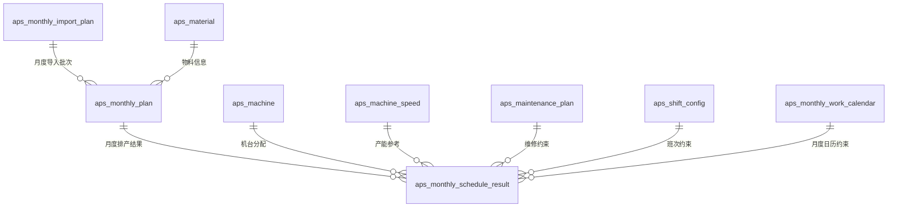
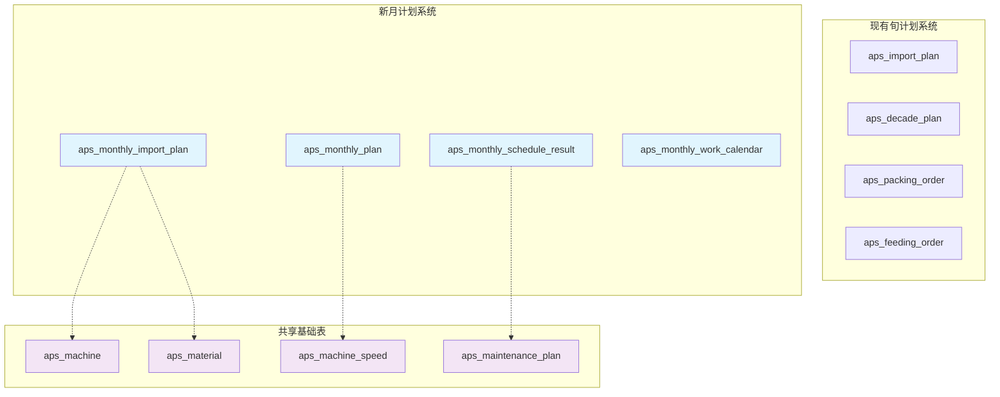
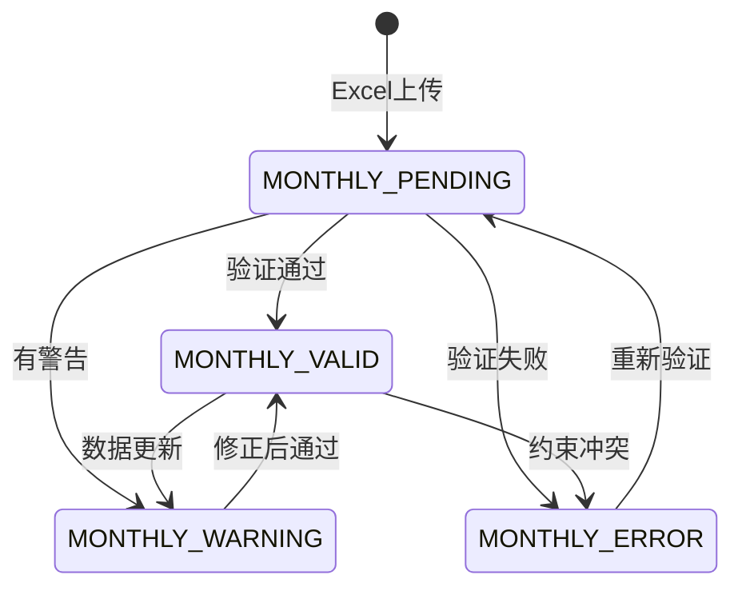
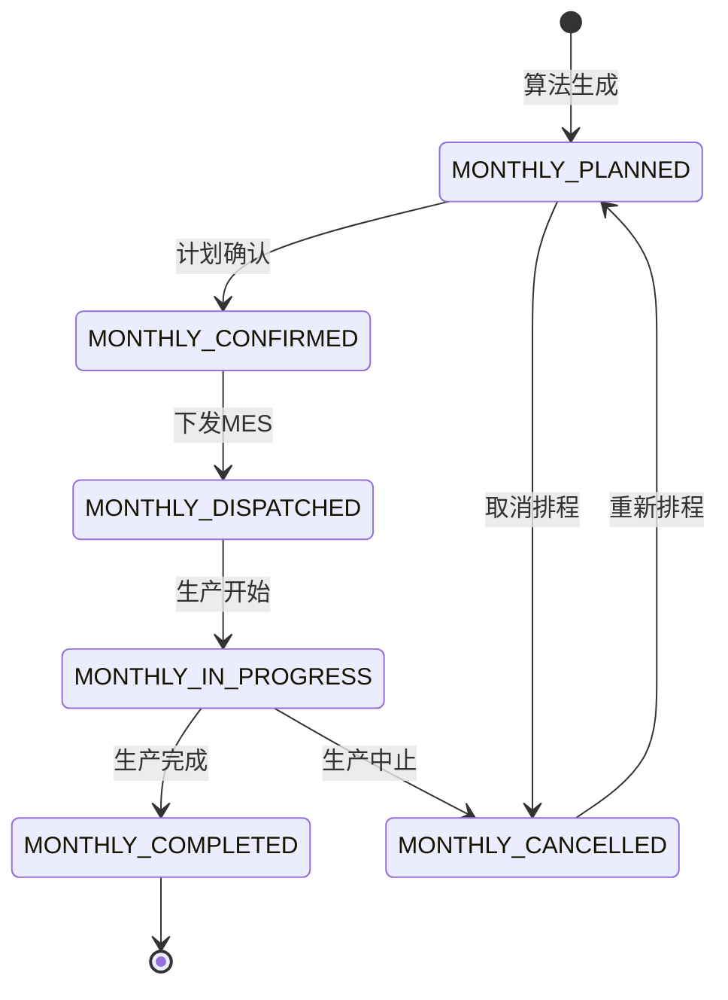

# 数据模型设计文档：月计划Excel直接排产功能（冲突避免版本）

**功能分支**: `001-aps-v2-2019`  
**创建时间**: 2025-01-16  
**状态**: 冲突避免设计文档  
**版本**: v2.0 - 独立设计

## 🔥 冲突避免设计原则

**核心原则**: 月计划功能与现有旬计划系统**完全独立**，零干扰现有业务

### 独立性保证
1. **表前缀差异化**：所有新表使用`aps_monthly_*`前缀，避免与现有`aps_decade_*`表冲突
2. **主键序列独立**：使用独立的ID序列，避免主键冲突
3. **外键约束隔离**：仅引用系统基础表（machine, material），不引用decade plan相关表
4. **路由前缀隔离**：API使用`/monthly-*`前缀，与现有`/plans`完全分离
5. **批次ID格式区分**：使用`MONTHLY_`前缀，与现有`IMPORT_`前缀区别
6. **枚举值区分**：所有枚举值添加`MONTHLY_`前缀避免冲突

---

## 概述

本文档定义月计划Excel直接排产功能的核心数据模型设计。基于现有APS智慧排产系统v3的数据架构，新增3个核心实体以支持月度生产计划处理，**确保与现有旬计划系统零冲突**。

### 设计目标
- **零冲突保证**：与现有旬计划系统完全独立，互不影响
- **业务支撑**：支持浙江中烟月计划Excel格式的完整处理流程
- **系统隔离**：独立的数据模型、API路由、业务流程
- **性能优化**：针对月度数据特点进行索引和查询优化
- **扩展性**：为未来更多计划类型和业务规则预留扩展空间

---

## 核心实体设计

### 1. 月计划基础数据表 (`aps_monthly_plan`)

**业务职责**: 存储Excel解析后的月度生产计划原始数据  
**冲突避免**: 使用`aps_monthly_plan`表名，与现有`aps_decade_plan`完全独立

#### 字段定义
```sql
CREATE TABLE `aps_monthly_plan` (
  `id` bigint NOT NULL AUTO_INCREMENT COMMENT '主键ID',
  `import_batch_id` varchar(50) NOT NULL COMMENT '导入批次ID（格式：MONTHLY_YYYYMMDD_HHMMSS_XXXX）',
  `monthly_plan_nr` varchar(50) NOT NULL COMMENT '月计划编号（格式：MP_YYYY_MM_XXXX）',
  `article_nr` varchar(100) NOT NULL COMMENT '成品烟牌号',
  `brand_specification` varchar(200) NOT NULL COMMENT '品牌规格（如"中华（软）84mm条盒"）',
  `package_type` varchar(50) DEFAULT NULL COMMENT '包装类型（软包/硬包）',
  `specification` varchar(50) DEFAULT NULL COMMENT '规格（长嘴/短嘴/超长嘴/中支/细支）',
  
  -- 数量字段（月计划特有）
  `target_quantity_boxes` int NOT NULL COMMENT '月度目标箱数 - 核心业务字段',
  `daily_average_quantity` int DEFAULT NULL COMMENT '日均产量（箱）',
  `weekly_distribution` json DEFAULT NULL COMMENT '按周分配 {"week1":0.25,"week2":0.25,"week3":0.25,"week4":0.25}',
  
  -- 时间字段（月度特有）
  `production_month` date NOT NULL COMMENT '生产月份（YYYY-MM-01格式）',
  `month_start_date` date NOT NULL COMMENT '月度开始日期',
  `month_end_date` date NOT NULL COMMENT '月度结束日期',
  `estimated_start_time` datetime DEFAULT NULL COMMENT '预估开始时间',
  `estimated_end_time` datetime DEFAULT NULL COMMENT '预估结束时间',
  
  -- 工厂和机台信息
  `factory_name` varchar(50) DEFAULT 'HANGZHOU' COMMENT '工厂名称（杭州/宁波）',
  `machine_assignments` json DEFAULT NULL COMMENT '机台分配JSON ["C1","C2","15","16"]',
  `suggested_machines` json DEFAULT NULL COMMENT '建议机台列表',
  
  -- 业务优先级
  `monthly_priority` int DEFAULT 5 COMMENT '月度优先级（1=最高，10=最低）',
  `urgency_flag` tinyint(1) DEFAULT 0 COMMENT '紧急标志',
  `customer_importance` enum('VIP','NORMAL','LOW') DEFAULT 'NORMAL' COMMENT '客户重要性',
  
  -- 月计划特有属性
  `seasonal_factor` decimal(3,2) DEFAULT 1.00 COMMENT '季节性系数',
  `market_demand_factor` decimal(3,2) DEFAULT 1.00 COMMENT '市场需求系数',
  `inventory_buffer_days` int DEFAULT 0 COMMENT '库存缓冲天数',
  `monthly_target_type` enum('MONTHLY_PRODUCTION','MONTHLY_DELIVERY','MONTHLY_INVENTORY') DEFAULT 'MONTHLY_PRODUCTION' COMMENT '月度目标类型',
  
  -- Excel解析信息
  `excel_file_name` varchar(200) DEFAULT NULL COMMENT 'Excel原始文件名',
  `excel_sheet_name` varchar(100) DEFAULT NULL COMMENT 'Excel工作表名称',
  `excel_row_number` int DEFAULT NULL COMMENT 'Excel原始行号',
  `excel_original_data` json DEFAULT NULL COMMENT 'Excel原始数据JSON',
  
  -- 数据质量（独立验证）
  `monthly_validation_status` enum('MONTHLY_VALID','MONTHLY_WARNING','MONTHLY_ERROR','MONTHLY_PENDING') DEFAULT 'MONTHLY_PENDING' COMMENT '月计划验证状态',
  `validation_errors` json DEFAULT NULL COMMENT '验证错误列表',
  `data_quality_score` decimal(3,2) DEFAULT NULL COMMENT '数据质量评分（0-1）',
  `completeness_score` decimal(3,2) DEFAULT NULL COMMENT '数据完整性评分',
  
  -- 审计字段
  `created_by` varchar(100) DEFAULT 'monthly_system' COMMENT '创建者',
  `created_time` datetime DEFAULT CURRENT_TIMESTAMP COMMENT '创建时间',
  `updated_time` datetime DEFAULT CURRENT_TIMESTAMP ON UPDATE CURRENT_TIMESTAMP COMMENT '更新时间',
  `monthly_version` int DEFAULT 1 COMMENT '月计划版本号',
  
  -- 主键和索引
  PRIMARY KEY (`id`) USING BTREE,
  
  -- 业务唯一约束（避免与decade plan冲突）
  UNIQUE KEY `uk_monthly_plan_unique` (`import_batch_id`, `monthly_plan_nr`, `article_nr`, `production_month`) USING BTREE,
  
  -- 月度特有索引
  KEY `idx_production_month` (`production_month`) USING BTREE,
  KEY `idx_target_quantity_boxes` (`target_quantity_boxes`) USING BTREE,
  KEY `idx_monthly_priority` (`monthly_priority`, `urgency_flag`) USING BTREE,
  KEY `idx_monthly_validation_status` (`monthly_validation_status`) USING BTREE,
  KEY `idx_factory_month` (`factory_name`, `production_month`) USING BTREE,
  KEY `idx_article_month` (`article_nr`, `production_month`) USING BTREE,
  KEY `idx_monthly_batch` (`import_batch_id`) USING BTREE,
  
  -- 外键约束（仅引用基础表，避免与decade plan耦合）
  CONSTRAINT `fk_monthly_plan_material` FOREIGN KEY (`article_nr`) 
    REFERENCES `aps_material` (`article_nr`) ON DELETE RESTRICT ON UPDATE RESTRICT
    
) ENGINE=InnoDB DEFAULT CHARSET=utf8mb4 COLLATE=utf8mb4_0900_ai_ci 
COMMENT='月度生产计划基础数据表-独立于旬计划系统';
```

#### 冲突避免验证规则
- `import_batch_id` 必须以`MONTHLY_`开头
- `monthly_plan_nr` 必须以`MP_`开头
- `target_quantity_boxes` > 0
- `production_month` 格式必须为每月1号（YYYY-MM-01）
- `monthly_priority` 范围：1-10
- `seasonal_factor` 范围：0.01-5.00

---

### 2. 月度工作日历表 (`aps_monthly_work_calendar`)

**业务职责**: 专为月计划定义工作日、节假日、班次信息  
**冲突避免**: 独立的工作日历表，与现有系统工作日历隔离

#### 字段定义
```sql
CREATE TABLE `aps_monthly_work_calendar` (
  `id` bigint NOT NULL AUTO_INCREMENT COMMENT '主键ID',
  `calendar_date` date NOT NULL COMMENT '日历日期',
  `calendar_year` int NOT NULL COMMENT '年份',
  `calendar_month` int NOT NULL COMMENT '月份',
  `calendar_day` int NOT NULL COMMENT '日期',
  `weekday_number` int NOT NULL COMMENT '星期几（1=周一，7=周日）',
  
  -- 月度工作日类型（独立命名避免冲突）
  `is_monthly_workday` tinyint(1) NOT NULL DEFAULT 1 COMMENT '是否月度工作日',
  `monthly_day_type` enum('MONTHLY_WORKDAY','MONTHLY_WEEKEND','MONTHLY_HOLIDAY','MONTHLY_SPECIAL_WORKDAY') NOT NULL DEFAULT 'MONTHLY_WORKDAY' COMMENT '月度日期类型',
  `monthly_holiday_name` varchar(100) DEFAULT NULL COMMENT '节假日名称',
  `monthly_holiday_type` enum('MONTHLY_NATIONAL','MONTHLY_COMPANY','MONTHLY_MAINTENANCE') DEFAULT NULL COMMENT '节假日类型',
  
  -- 月度班次信息
  `monthly_shift_pattern` varchar(50) DEFAULT 'MONTHLY_STANDARD' COMMENT '月度班次模式',
  `monthly_available_shifts` json DEFAULT NULL COMMENT '可用班次 ["MONTHLY_DAY","MONTHLY_NIGHT","MONTHLY_OVERTIME"]',
  `monthly_total_work_hours` decimal(4,2) DEFAULT 8.00 COMMENT '月度总工作小时数',
  
  -- 月度产能调整
  `monthly_capacity_factor` decimal(3,2) DEFAULT 1.00 COMMENT '月度产能系数',
  `monthly_efficiency_factor` decimal(3,2) DEFAULT 1.00 COMMENT '月度效率系数',
  
  -- 月度特殊标记
  `is_month_start` tinyint(1) DEFAULT 0 COMMENT '是否月初',
  `is_month_middle` tinyint(1) DEFAULT 0 COMMENT '是否月中',
  `is_month_end` tinyint(1) DEFAULT 0 COMMENT '是否月末',
  `is_quarter_end` tinyint(1) DEFAULT 0 COMMENT '是否季末',
  
  -- 月度业务规则
  `allow_monthly_scheduling` tinyint(1) DEFAULT 1 COMMENT '是否允许月度排产',
  `allow_monthly_overtime` tinyint(1) DEFAULT 0 COMMENT '是否允许月度加班',
  `monthly_max_overtime_hours` decimal(4,2) DEFAULT 0.00 COMMENT '月度最大加班小时数',
  
  -- 月度优先级调整
  `monthly_priority_boost` decimal(2,1) DEFAULT 0.0 COMMENT '月度优先级提升',
  `monthly_rush_flag` tinyint(1) DEFAULT 0 COMMENT '月度赶工标志',
  
  -- 审计字段
  `created_time` datetime DEFAULT CURRENT_TIMESTAMP COMMENT '创建时间',
  `updated_time` datetime DEFAULT CURRENT_TIMESTAMP ON UPDATE CURRENT_TIMESTAMP COMMENT '更新时间',
  `monthly_calendar_version` int DEFAULT 1 COMMENT '月度日历版本',
  
  -- 主键和索引
  PRIMARY KEY (`id`) USING BTREE,
  
  -- 业务唯一约束
  UNIQUE KEY `uk_monthly_calendar_date` (`calendar_date`) USING BTREE,
  
  -- 月度特有索引
  KEY `idx_monthly_year_month` (`calendar_year`, `calendar_month`) USING BTREE,
  KEY `idx_monthly_workday` (`is_monthly_workday`, `monthly_day_type`) USING BTREE,
  KEY `idx_monthly_allow_scheduling` (`allow_monthly_scheduling`) USING BTREE,
  KEY `idx_monthly_calendar_range` (`calendar_date`, `is_monthly_workday`, `allow_monthly_scheduling`) USING BTREE,
  KEY `idx_monthly_weekday` (`weekday_number`) USING BTREE,
  KEY `idx_monthly_special_dates` (`is_month_start`, `is_month_end`, `is_quarter_end`) USING BTREE
  
) ENGINE=InnoDB DEFAULT CHARSET=utf8mb4 COLLATE=utf8mb4_0900_ai_ci 
COMMENT='月度工作日历表-独立于现有日历系统';
```

#### 冲突避免验证规则
- 所有字段名带`monthly_`前缀避免与现有工作日历冲突
- `weekday_number` 范围：1-7
- `monthly_capacity_factor` 范围：0.01-3.00
- `monthly_efficiency_factor` 范围：0.01-2.00
- `monthly_total_work_hours` 范围：0-24
- `monthly_max_overtime_hours` 范围：0-12

---

### 3. 月度排产结果表 (`aps_monthly_schedule_result`)

**业务职责**: 存储月度排产算法生成的机台分配结果和时间安排  
**冲突避免**: 使用`aps_monthly_schedule_result`表名，与现有排产结果表完全独立

#### 字段定义
```sql
CREATE TABLE `aps_monthly_schedule_result` (
  `id` bigint NOT NULL AUTO_INCREMENT COMMENT '主键ID',
  `monthly_plan_id` bigint NOT NULL COMMENT '关联月计划ID',
  `import_batch_id` varchar(50) NOT NULL COMMENT '导入批次ID',
  `monthly_plan_nr` varchar(50) NOT NULL COMMENT '月计划编号',
  `monthly_work_order_nr` varchar(50) NOT NULL COMMENT '月度工单号（格式：MW_YYYY_MM_XXXX）',
  `article_nr` varchar(100) NOT NULL COMMENT '成品烟牌号',
  `brand_specification` varchar(200) NOT NULL COMMENT '品牌规格',
  
  -- 月度机台分配
  `assigned_machine_code` varchar(20) NOT NULL COMMENT '分配机台代码',
  `monthly_machine_type` enum('MONTHLY_PACKING','MONTHLY_FEEDING') NOT NULL COMMENT '月度机台类型',
  `monthly_feeder_code` varchar(20) DEFAULT NULL COMMENT '关联喂丝机代码',
  `monthly_maker_code` varchar(20) DEFAULT NULL COMMENT '关联卷包机代码',
  `machine_group_id` varchar(50) DEFAULT NULL COMMENT '机台组ID',
  
  -- 月度数量分配
  `allocated_boxes` int NOT NULL COMMENT '分配到该机台的箱数',
  `original_target_boxes` int NOT NULL COMMENT '原始目标箱数',
  `monthly_allocation_ratio` decimal(5,4) NOT NULL COMMENT '月度分配比例（0-1）',
  `daily_allocation_plan` json DEFAULT NULL COMMENT '日分配计划JSON',
  
  -- 月度时间安排
  `monthly_planned_start_time` datetime NOT NULL COMMENT '月度计划开始时间',
  `monthly_planned_end_time` datetime NOT NULL COMMENT '月度计划结束时间',
  `monthly_estimated_duration_minutes` int NOT NULL COMMENT '月度预计持续时间（分钟）',
  `monthly_actual_work_hours` decimal(6,2) NOT NULL COMMENT '月度实际工作小时数',
  `monthly_work_days` int NOT NULL COMMENT '月度工作天数',
  
  -- 月度算法信息
  `monthly_scheduling_algorithm` varchar(50) DEFAULT 'MONTHLY_STANDARD_V1' COMMENT '月度排产算法',
  `monthly_algorithm_version` varchar(20) DEFAULT '1.0' COMMENT '月度算法版本',
  `monthly_optimization_score` decimal(8,4) DEFAULT NULL COMMENT '月度优化评分',
  `monthly_confidence_level` decimal(3,2) DEFAULT 0.95 COMMENT '月度置信度',
  
  -- 月度约束信息
  `monthly_applied_constraints` json DEFAULT NULL COMMENT '应用的月度约束条件',
  `monthly_constraint_violations` json DEFAULT NULL COMMENT '月度约束冲突信息',
  `monthly_resolution_strategy` varchar(100) DEFAULT NULL COMMENT '月度冲突解决策略',
  
  -- 月度产能计算
  `monthly_machine_speed_boxes_per_hour` decimal(8,2) NOT NULL COMMENT '月度机台速度（箱/小时）',
  `monthly_efficiency_rate_percent` decimal(5,2) NOT NULL COMMENT '月度效率系数（%）',
  `monthly_utilization_rate_percent` decimal(5,2) DEFAULT NULL COMMENT '月度机台利用率（%）',
  `monthly_theoretical_capacity` decimal(10,2) NOT NULL COMMENT '月度理论产能（箱）',
  
  -- 月度业务状态
  `monthly_schedule_status` enum('MONTHLY_PLANNED','MONTHLY_CONFIRMED','MONTHLY_DISPATCHED','MONTHLY_IN_PROGRESS','MONTHLY_COMPLETED','MONTHLY_CANCELLED') 
    DEFAULT 'MONTHLY_PLANNED' COMMENT '月度排程状态',
  `monthly_schedule_priority` int DEFAULT 5 COMMENT '月度排程优先级',
  `is_monthly_backup_plan` tinyint(1) DEFAULT 0 COMMENT '是否月度备用方案',
  `monthly_backup_reason` varchar(200) DEFAULT NULL COMMENT '月度备用方案原因',
  
  -- 月度分组和序列
  `monthly_schedule_group_id` varchar(50) DEFAULT NULL COMMENT '月度排程分组ID',
  `monthly_sequence_in_group` int DEFAULT 1 COMMENT '月度组内序号',
  `monthly_global_sequence` int DEFAULT NULL COMMENT '月度全局序号',
  
  -- 月度质量指标
  `monthly_quality_score` decimal(5,2) DEFAULT NULL COMMENT '月度排程质量评分',
  `monthly_risk_level` enum('MONTHLY_LOW','MONTHLY_MEDIUM','MONTHLY_HIGH','MONTHLY_CRITICAL') DEFAULT 'MONTHLY_LOW' COMMENT '月度风险等级',
  `monthly_cost_estimate` decimal(12,2) DEFAULT NULL COMMENT '月度成本估算',
  
  -- 月度协调信息
  `monthly_sync_group_id` varchar(50) DEFAULT NULL COMMENT '月度同步组ID（卷包机+喂丝机协调）',
  `requires_monthly_coordination` tinyint(1) DEFAULT 0 COMMENT '是否需要月度协调',
  `monthly_coordination_notes` text DEFAULT NULL COMMENT '月度协调备注',
  
  -- 审计字段
  `created_by` varchar(100) DEFAULT 'monthly_system' COMMENT '创建者',
  `created_time` datetime DEFAULT CURRENT_TIMESTAMP COMMENT '创建时间',
  `updated_time` datetime DEFAULT CURRENT_TIMESTAMP ON UPDATE CURRENT_TIMESTAMP COMMENT '更新时间',
  `monthly_approved_by` varchar(100) DEFAULT NULL COMMENT '月度审批者',
  `monthly_approved_time` datetime DEFAULT NULL COMMENT '月度审批时间',
  
  -- 主键和索引
  PRIMARY KEY (`id`) USING BTREE,
  
  -- 月度业务查询索引
  KEY `idx_monthly_plan_id` (`monthly_plan_id`) USING BTREE,
  KEY `idx_assigned_machine_code` (`assigned_machine_code`) USING BTREE,
  KEY `idx_monthly_planned_time` (`monthly_planned_start_time`, `monthly_planned_end_time`) USING BTREE,
  KEY `idx_monthly_schedule_status` (`monthly_schedule_status`) USING BTREE,
  KEY `idx_monthly_work_order` (`monthly_work_order_nr`) USING BTREE,
  KEY `idx_monthly_import_batch` (`import_batch_id`) USING BTREE,
  KEY `idx_monthly_article_machine` (`article_nr`, `assigned_machine_code`) USING BTREE,
  KEY `idx_monthly_schedule_group` (`monthly_schedule_group_id`, `monthly_sequence_in_group`) USING BTREE,
  KEY `idx_monthly_sync_group` (`monthly_sync_group_id`) USING BTREE,
  
  -- 月度复合索引
  KEY `idx_monthly_machine_time_status` (`assigned_machine_code`, `monthly_planned_start_time`, `monthly_schedule_status`) USING BTREE,
  KEY `idx_monthly_batch_status_priority` (`import_batch_id`, `monthly_schedule_status`, `monthly_schedule_priority`) USING BTREE,
  
  -- 外键约束（仅引用月度表和基础表）
  CONSTRAINT `fk_monthly_result_plan` FOREIGN KEY (`monthly_plan_id`) 
    REFERENCES `aps_monthly_plan` (`id`) ON DELETE CASCADE ON UPDATE RESTRICT,
  CONSTRAINT `fk_monthly_result_machine` FOREIGN KEY (`assigned_machine_code`) 
    REFERENCES `aps_machine` (`machine_code`) ON DELETE RESTRICT ON UPDATE RESTRICT,
  CONSTRAINT `fk_monthly_result_material` FOREIGN KEY (`article_nr`) 
    REFERENCES `aps_material` (`article_nr`) ON DELETE RESTRICT ON UPDATE RESTRICT
    
) ENGINE=InnoDB DEFAULT CHARSET=utf8mb4 COLLATE=utf8mb4_0900_ai_ci 
COMMENT='月度排产结果表-完全独立的月度算法输出';
```

#### 冲突避免验证规则
- `monthly_work_order_nr` 必须以`MW_`开头（区别于现有工单前缀）
- `allocated_boxes` > 0
- `monthly_allocation_ratio` 范围：0.0001-1.0000
- `monthly_efficiency_rate_percent` 范围：1-100
- `monthly_utilization_rate_percent` 范围：0-100
- `monthly_confidence_level` 范围：0.01-1.00
- `monthly_planned_end_time` > `monthly_planned_start_time`
- 同一机台在同一时间段不能重叠

---

## 与现有系统的隔离设计

### 1. 批次ID格式隔离
```sql
-- 现有系统格式: IMPORT_20241016_153000_a1b2c3d4
-- 月计划格式:   MONTHLY_20241016_153000_a1b2c3d4
-- 通过前缀完全隔离，避免ID冲突

-- 批次ID验证函数
DELIMITER //
CREATE FUNCTION validate_monthly_batch_id(batch_id VARCHAR(50)) 
RETURNS BOOLEAN
READS SQL DATA
BEGIN
    RETURN batch_id LIKE 'MONTHLY_%';
END //
DELIMITER ;
```

### 2. 工单号格式隔离
```sql
-- 现有系统工单格式: WO_001, WO_002...
-- 月度工单格式:     MW_2024_07_001, MW_2024_07_002...
-- 完全不同的命名规则，避免工单号冲突

-- 月度工单号生成函数
DELIMITER //
CREATE FUNCTION generate_monthly_work_order_nr(plan_month DATE) 
RETURNS VARCHAR(50)
READS SQL DATA
BEGIN
    DECLARE next_seq INT DEFAULT 1;
    DECLARE year_month VARCHAR(7);
    DECLARE result VARCHAR(50);
    
    SET year_month = DATE_FORMAT(plan_month, '%Y_%m');
    
    SELECT COALESCE(MAX(CAST(SUBSTRING_INDEX(monthly_work_order_nr, '_', -1) AS UNSIGNED)), 0) + 1 
    INTO next_seq
    FROM aps_monthly_schedule_result 
    WHERE monthly_work_order_nr LIKE CONCAT('MW_', year_month, '_%');
    
    SET result = CONCAT('MW_', year_month, '_', LPAD(next_seq, 3, '0'));
    RETURN result;
END //
DELIMITER ;
```

### 3. 状态枚举隔离
```sql
-- 现有系统状态: VALID, ERROR, WARNING, PENDING
-- 月计划状态:   MONTHLY_VALID, MONTHLY_ERROR, MONTHLY_WARNING, MONTHLY_PENDING
-- 所有枚举值都带MONTHLY_前缀，完全避免枚举值冲突

-- 状态转换验证
DELIMITER //
CREATE FUNCTION validate_monthly_status_transition(
    old_status VARCHAR(20), 
    new_status VARCHAR(20)
) 
RETURNS BOOLEAN
READS SQL DATA
BEGIN
    -- 月计划状态转换规则
    CASE old_status
        WHEN 'MONTHLY_PENDING' THEN RETURN new_status IN ('MONTHLY_VALID', 'MONTHLY_WARNING', 'MONTHLY_ERROR');
        WHEN 'MONTHLY_VALID' THEN RETURN new_status IN ('MONTHLY_WARNING', 'MONTHLY_ERROR');
        WHEN 'MONTHLY_WARNING' THEN RETURN new_status IN ('MONTHLY_VALID', 'MONTHLY_ERROR');
        WHEN 'MONTHLY_ERROR' THEN RETURN new_status IN ('MONTHLY_PENDING');
        ELSE RETURN FALSE;
    END CASE;
END //
DELIMITER ;
```

### 4. 引用关系隔离
```sql
-- 月计划系统仅引用系统基础表，不引用decade plan相关表
-- 允许的外键引用：
-- ✅ aps_machine (机台基础信息)
-- ✅ aps_material (物料基础信息)  
-- ✅ aps_machine_speed (机台速度配置)
-- ❌ aps_decade_plan (旬计划数据)
-- ❌ aps_import_plan (导入计划，因为格式不同)

-- 创建月度专用的导入记录表
CREATE TABLE `aps_monthly_import_plan` (
  `id` bigint NOT NULL AUTO_INCREMENT,
  `import_batch_id` varchar(50) NOT NULL COMMENT '月度导入批次ID',
  `file_name` varchar(200) NOT NULL COMMENT '文件名',
  `file_path` varchar(500) NOT NULL COMMENT '文件路径',
  `file_size` bigint DEFAULT NULL COMMENT '文件大小',
  `total_records` int DEFAULT 0 COMMENT '总记录数',
  `valid_records` int DEFAULT 0 COMMENT '有效记录数',
  `error_records` int DEFAULT 0 COMMENT '错误记录数',
  `hangzhou_records` int DEFAULT 0 COMMENT '杭州厂记录数',
  `ningbo_records` int DEFAULT 0 COMMENT '宁波厂记录数',
  `import_status` enum('MONTHLY_UPLOADING','MONTHLY_PARSING','MONTHLY_COMPLETED','MONTHLY_FAILED') DEFAULT 'MONTHLY_UPLOADING',
  `import_start_time` datetime DEFAULT NULL,
  `import_end_time` datetime DEFAULT NULL,
  `error_message` text,
  `created_by` varchar(100) DEFAULT 'monthly_system',
  `created_time` datetime DEFAULT CURRENT_TIMESTAMP,
  PRIMARY KEY (`id`),
  UNIQUE KEY `uk_monthly_import_batch` (`import_batch_id`),
  KEY `idx_monthly_import_status` (`import_status`),
  KEY `idx_monthly_import_time` (`created_time`)
) ENGINE=InnoDB DEFAULT CHARSET=utf8mb4 COLLATE=utf8mb4_0900_ai_ci 
COMMENT='月度导入计划表-完全独立于现有导入表';
```

---

## 数据关系图（隔离版本）



### 与现有系统的隔离边界


---

## 状态转换设计（隔离版本）

### 1. 月计划状态转换 (`monthly_validation_status`)



### 2. 月度排产结果状态转换 (`monthly_schedule_status`)



---

## 索引策略与性能优化（隔离版本）

### 1. 月度查询模式分析
**热点查询**:
- 按月份查询月计划：`(production_month, monthly_validation_status)`
- 按机台查询月度排产结果：`(assigned_machine_code, monthly_planned_start_time)`
- 按时间范围查询月度工作日历：`(calendar_date, is_monthly_workday)`
- 按批次查询月度处理状态：`(import_batch_id, monthly_schedule_status)`

### 2. 月度复合索引设计
```sql
-- 月计划核心查询索引
CREATE INDEX `idx_monthly_plan_core` ON `aps_monthly_plan` 
(`production_month`, `monthly_validation_status`, `monthly_priority`, `target_quantity_boxes`);

-- 月度排产结果时间查询索引  
CREATE INDEX `idx_monthly_schedule_time` ON `aps_monthly_schedule_result` 
(`assigned_machine_code`, `monthly_planned_start_time`, `monthly_planned_end_time`, `monthly_schedule_status`);

-- 月度工作日历范围查询索引
CREATE INDEX `idx_monthly_calendar_range` ON `aps_monthly_work_calendar` 
(`calendar_date`, `is_monthly_workday`, `allow_monthly_scheduling`, `monthly_day_type`);
```

### 3. 月度分区策略建议
```sql
-- 按月份分区 aps_monthly_plan
ALTER TABLE `aps_monthly_plan` 
PARTITION BY RANGE (YEAR(production_month) * 100 + MONTH(production_month)) (
    PARTITION mp202401 VALUES LESS THAN (202402),
    PARTITION mp202402 VALUES LESS THAN (202403),
    -- ... 按月分区，前缀mp区别于现有分区
);

-- 按日期分区 aps_monthly_work_calendar
ALTER TABLE `aps_monthly_work_calendar` 
PARTITION BY RANGE (YEAR(calendar_date)) (
    PARTITION mc2024 VALUES LESS THAN (2025),
    PARTITION mc2025 VALUES LESS THAN (2026),
    PARTITION mc2026 VALUES LESS THAN (2027)
);
```

---

## 初始化脚本（冲突避免版本）

### 1. 月度工作日历数据初始化
```sql
-- 初始化2024-2026年月度工作日历（独立数据）
INSERT INTO `aps_monthly_work_calendar` (
    `calendar_date`, `calendar_year`, `calendar_month`, `calendar_day`, `weekday_number`,
    `is_monthly_workday`, `monthly_day_type`, `monthly_total_work_hours`
) 
SELECT 
    date_val,
    YEAR(date_val),
    MONTH(date_val), 
    DAY(date_val),
    WEEKDAY(date_val) + 1,
    CASE WHEN WEEKDAY(date_val) < 5 THEN 1 ELSE 0 END,
    CASE WHEN WEEKDAY(date_val) < 5 THEN 'MONTHLY_WORKDAY' ELSE 'MONTHLY_WEEKEND' END,
    CASE WHEN WEEKDAY(date_val) < 5 THEN 8.00 ELSE 0.00 END
FROM (
    SELECT DATE_ADD('2024-01-01', INTERVAL seq DAY) as date_val
    FROM (
        SELECT (h1.n + h2.n*10 + h3.n*100 + h4.n*1000) as seq
        FROM 
        (SELECT 0 as n UNION SELECT 1 UNION SELECT 2 UNION SELECT 3 UNION SELECT 4 UNION SELECT 5 UNION SELECT 6 UNION SELECT 7 UNION SELECT 8 UNION SELECT 9) h1,
        (SELECT 0 as n UNION SELECT 1 UNION SELECT 2 UNION SELECT 3 UNION SELECT 4 UNION SELECT 5 UNION SELECT 6 UNION SELECT 7 UNION SELECT 8 UNION SELECT 9) h2,
        (SELECT 0 as n UNION SELECT 1 UNION SELECT 2 UNION SELECT 3 UNION SELECT 4 UNION SELECT 5 UNION SELECT 6 UNION SELECT 7 UNION SELECT 8 UNION SELECT 9) h3,
        (SELECT 0 as n UNION SELECT 1 UNION SELECT 2) h4
    ) seq_table
    WHERE DATE_ADD('2024-01-01', INTERVAL seq DAY) <= '2026-12-31'
) date_range;

-- 更新月度法定节假日
UPDATE `aps_monthly_work_calendar` SET 
    `is_monthly_workday` = 0, 
    `monthly_day_type` = 'MONTHLY_HOLIDAY',
    `monthly_holiday_name` = '元旦',
    `monthly_holiday_type` = 'MONTHLY_NATIONAL',
    `monthly_total_work_hours` = 0.00
WHERE `calendar_date` IN ('2024-01-01', '2025-01-01', '2026-01-01');
```

### 2. 月度系统配置初始化
```sql
-- 创建月度系统配置表
CREATE TABLE `aps_monthly_system_config` (
  `id` bigint NOT NULL AUTO_INCREMENT,
  `config_category` varchar(50) NOT NULL COMMENT '配置分类',
  `config_key` varchar(100) NOT NULL COMMENT '配置键',
  `config_value` json NOT NULL COMMENT '配置值',
  `effective_from` date NOT NULL COMMENT '生效日期',
  `effective_to` date DEFAULT NULL COMMENT '失效日期',
  `config_status` enum('MONTHLY_ACTIVE','MONTHLY_INACTIVE') DEFAULT 'MONTHLY_ACTIVE',
  PRIMARY KEY (`id`),
  UNIQUE KEY `uk_monthly_system_config` (`config_category`, `config_key`, `effective_from`)
) COMMENT='月度系统配置表-独立配置';

-- 月度系统配置数据
INSERT INTO `aps_monthly_system_config` VALUES
('MONTHLY_ALGORITHM', 'DEFAULT_PRIORITY_LEVEL', '5', '2024-01-01', NULL, 'MONTHLY_ACTIVE'),
('MONTHLY_ALGORITHM', 'MAX_ALLOCATION_RATIO', '1.0', '2024-01-01', NULL, 'MONTHLY_ACTIVE'),
('MONTHLY_ALGORITHM', 'MIN_EFFICIENCY_RATE', '0.70', '2024-01-01', NULL, 'MONTHLY_ACTIVE'),
('MONTHLY_VALIDATION', 'MIN_TARGET_QUANTITY', '1', '2024-01-01', NULL, 'MONTHLY_ACTIVE'),
('MONTHLY_VALIDATION', 'MAX_TARGET_QUANTITY', '50000', '2024-01-01', NULL, 'MONTHLY_ACTIVE'),
('MONTHLY_BUSINESS', 'PLAN_LEAD_DAYS', '7', '2024-01-01', NULL, 'MONTHLY_ACTIVE'),
('MONTHLY_BUSINESS', 'HANGZHOU_ONLY_FLAG', 'true', '2024-01-01', NULL, 'MONTHLY_ACTIVE');
```

---

## 总结

本冲突避免版本的数据模型设计完全确保了月计划功能与现有旬计划系统的独立性：

### 🔥 冲突避免核心措施
1. **表名完全隔离**: 所有新表使用`aps_monthly_*`前缀
2. **字段名差异化**: 关键字段带`monthly_`前缀避免混淆
3. **枚举值隔离**: 所有枚举值带`MONTHLY_`前缀
4. **ID格式区分**: 批次ID和工单号使用不同格式前缀
5. **状态系统独立**: 完全独立的状态转换逻辑
6. **外键关系隔离**: 仅引用基础表，不与现有业务表耦合
7. **API路由隔离**: 使用`/monthly-*`路由前缀
8. **索引命名区分**: 所有索引使用`monthly_`前缀

### 核心优势
1. **零冲突保证**: 与现有旬计划系统完全独立，互不影响
2. **业务完整性**: 完整支持从Excel解析到工单生成的全流程
3. **系统隔离性**: 独立的数据模型、状态管理、业务逻辑
4. **性能优化**: 针对月度数据特点设计索引和分区策略
5. **扩展性**: 预留扩展字段和配置化支持，适应未来业务发展

该数据模型为后续的算法实现、API开发和前端界面提供了坚实的数据基础，同时完全避免了与现有系统的任何潜在冲突。